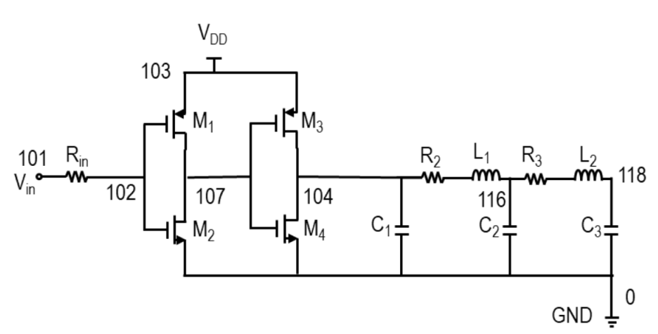
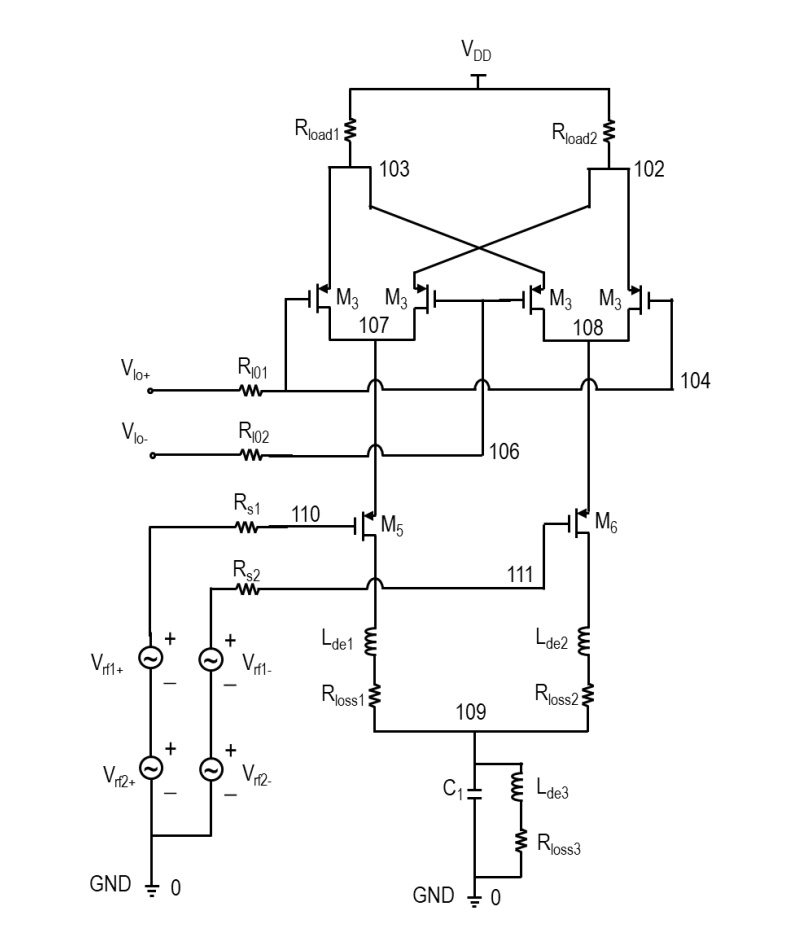
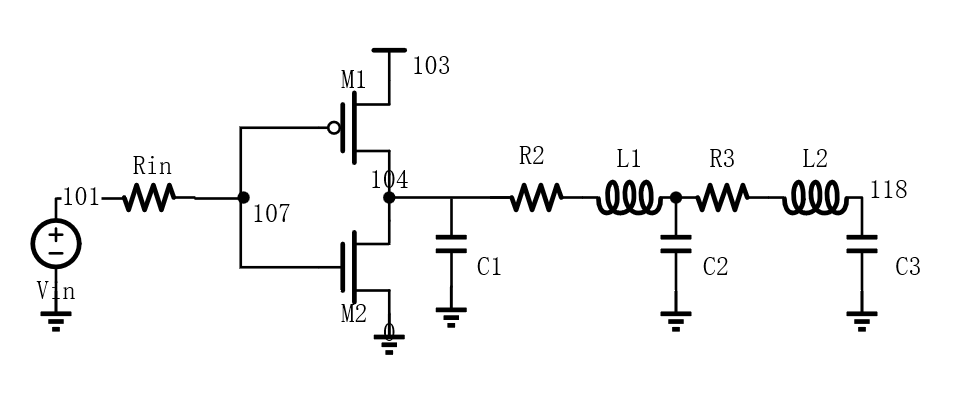
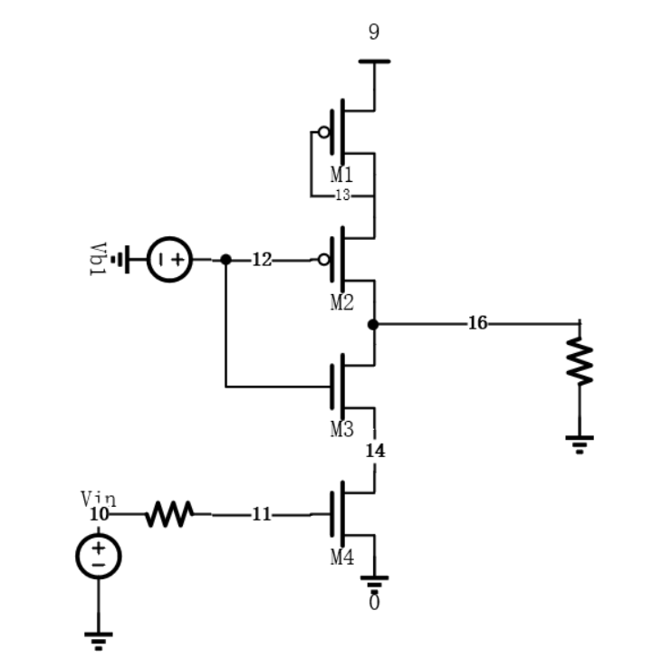
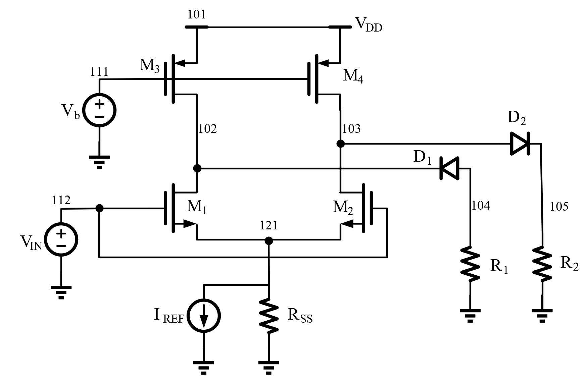

# 模拟EDA SPICE工具

该项目是由复旦大学模拟集成电路设计自动化课程布置的课程作业。项目实现了一个基本的电路 SPICE 工具(Simulation Program with Integrated Circuit Emphasis)，可以对包含 MOSFET（简单的level1模型）、电阻、电容和电感的电路执行 DC 分析以及瞬态分析。

## 项目成员

| 成员名称 |          学号           |
| :----- |:---------------------:|
| 郑志宇 |      20307130176      |
| 朱瑞宸 |      20300240019      |
| 林与正 |      20307130137      |
| 张润洲 |      19307130046      |

## 功能说明

该工具可以读入电路网表文件，然后执行 DC 分析、瞬态分析等，生成对应的输出结果。支持的电路元件包括 MOSFET、二极管、电阻、电容、电感等。

在 MOSFET 模型中，使用了简化版的 SPICE Level = 1 的 MOS 模型。MOSFET 的源端和漏端不是固定的，需要由两个端口当前的电压值来判断。

在 Diode 模型中，使用了简化版的 SPICE Level = 1 的 Diode 模型。默认二极管工作在27℃下。

## 创新点

1. 电流打印。 除了项目提供网表中打印电压的功能，额外完成了电流的输出、索引和打印； 

2. 源漏互换。迭代过程考虑了MOS管源漏交换的情况，可以处理输入网表源漏与电路实际源漏情况相反的情况；

3. 二极管仿真。依据MOS管迭代求解思路，完成了如二极管等其他非线性器件的引入； 

4. 直流扫描。在单点dc分析的基础上增加了直流扫描的功能，可以以所需步长考察所需端点电压/器件电流随输入电压的变化

5. hspice仿真分析。利用hspice对每个实例电路进行了分析，并通过与查阅的标准spice模型对比，进行误差分析、正确性评估与优化

6. 时间复杂度较低。运行bufferDC.sp文件，计算直流工作点时，仅用时0.275s，主要优化体现在：
* 迭代更新电路方程的过程使用在不贴入"非线性器件生成的线性器件"得到的矩阵基础上贴入每轮更新的器件值，避免每轮重新生成矩阵或额外空间保留上一轮器件值；
* 进行节点映射，将节点映射为0~N的连续整数，大大降低了查找与遍历的成本
* 初始解的赋值上，本项目采用了自动化的赋值方法，从初始电压已知的节点Gnd和Vdd (Vcc)出发，遍历网表中的各个器件，为尽可能多的MOS管、二极管等非线性器件赋予合理的初始节点电压，以较低的复杂度实现了初始解的赋值

7. 空间利用率较高。主要体现在：
* DC扫描输出利用先生成索引后提取每轮结果的方法，避免消耗大量空间保存最终不需要打印观察的信息
* 存储数据类型尽量采用矩阵和数字的形式，减少字符的使用，减少变量空间占用的同时也可以减少变量类型转换的时间

8. 工程化程度较高。主要体现在：
* 将项目分成前后端来实现分工与合作，工作大体上分为预处理，网表生成，更新网表迭代，绘制图像这些部分划分，模块之间仅靠接口相互依赖，比较有实际的工程意义
* 关于项目的接口部分采用了哈希表来实现更快更高效的索引，同时可读性和可扩展性较强，向实际工程靠拢。
* 关于项目的结构方面，本项目在顶层模块有较高的抽象级，后续容易把项目拓展成有更高的兼容性的项目。

## 用法

### 环境要求

- MATLAB R2020b 或以上版本

### 如何使用

1. 根据要求书写电路网表文件，可以实现以下操作

   - `.dc`，直流工作点计算

     > 输入示例：
     >
     > .dc

   - `.dcsweep`，直流扫描，生成转移曲线

     > 输入示例：
     >
     > .dcsweep Vin [0,3] 0.01

   - `.hb`，AC频率响应分析`暂未实现`

     > 输入示例：
     >
     > `.hb 10e6 30`

   - `.trans`，瞬态响应分析`暂未实现`

     > 输入示例：
     >
     > `.trans total_time step`

   - `.plotnv node `，可以得到节点的电压

     > 输入示例：显示节点的电流
     >
     > `.plotnv 108 `
     >
     > etc.

   - `.plotnc Device(device_port)`，可以得到器件的节点电流

     > 输入示例：显示器件对应的节点的电流
     >
     > `.plotnc M1(d/g/s)`
     >
     > `.plotnc I1(+)`
     >
     > `.plotnc R1(-)`
     >
     > `.plotnc V1(+)`
     >
     > etc.

   - `.MODEL <mosID> VT <Value> MU <Value> COX <Value> LAMBDA <Value> CJ0 <Value>`创建一个MOS管模型，可以根据需求创建不同的MOS管模型，输入要求：MODEL的标号从1开始递增

     > 示例输入：
     >
     > `.MODEL 1 VT -0.75 MU 5e-2 COX 0.3e-4 LAMBDA 0.05 CJ0 4.0e-14`
     > `.MODEL 2 VT 0.83 MU 1.5e-1 COX 0.3e-4 LAMBDA 0.05 CJ0 4.0e-14`

3. 修改Top_module中的filename，在 MATLAB 中运行 `Top_module.m` 脚本得到结果

## 电路网表文件格式

电路网表文件是一个文本文件，格式如下：

要求，文件中`D, M, R, V, C, L, .`都是关键字，在给电阻电容电感命名的时候最好不要使用，避免被错误索引

```css
* non-inverting buffer
VDD 103 0 DC 3
Vin 101 0 SIN 1.5 2 10e6 0
Rin 101 102 10

M1   107 102 103 p 30e-6 0.35e-6 1
M2   107 102 0   n 10e-6 0.35e-6 2
M3   104 107 103 p 60e-6 0.35e-6 1
M4   104 107 0   n 20e-6 0.35e-6 2

C1 104 0 0.1e-12
R2 104 115 25
L1 115 116 0.5e-12
C2 116 0 0.5e-12
R3 116 117 35
L2 117 118 0.5e-12
C3 118 0 1e-12

.MODEL 1 VT -0.75 MU 5e-2 COX 0.3e-4 LAMBDA 0.05 CJ0 4.0e-14
.MODEL 2 VT 0.83 MU 1.5e-1 COX 0.3e-4 LAMBDA 0.05 CJ0 4.0e-14

.dc
.end
```

## 项目的结构

```bash
├── picture # README文档的说明图片
├── projectfile # 项目要求文档与参考资料
│   ├── HSPICE简明教程(复旦大学).pdf
│   ├── proj1_v03_tj.pdf	
│   ├── hspice_sa.pdf	
│   ├── HspiceManual完全手册.pdf		
├── testfile # 测试文件目录
│   ├── test_ori #项目所给的运行网表
│   ├── hspice_testfile #hspice测试所用网表
│   ├── AmplifierDC.sp      		
│   ├── AmplifierSweep.sp         	
│   ├── bufferDC.sp
│   ├── bufferSweep.sp
│   ├── dbmixerDC.sp 
│   ├── diftestDC.sp      		
│   ├── diftestSweep.sp         	
│   ├── invertbufferDC.sp
│   └── invertbufferSweep.sp
##### 工作文件夹
├── Top_module.m
├── parse_netlist.m
├── Generate_DCnetlist.m
│   ├── Gen_NodeInfo.m
│   ├── Gen_DeviceInfo.m
│   ├── init_value.m
│   ├── Mos_Calculator.m
│   └── Diode_Calculator.m
├── CalculateDC.m
│   ├──Gen_nextRes.m
│   │   ├──Mos_Calculator.m
│   │   ├──Diode_Calculator.m
│   ├──Gen_baseA.m
│   └──Gen_nextA.m
├── Sweep_DC.m
├── ValueCalc.m
├── portMapping.m
##### 
├── README.md # 项目说明文件
```

## 项目使用的示例文件

按照标准的电路网表文件进行输入产生电路，然后选择需要查看的端口或者器件的数据信息，选择 DC 或者瞬态仿真或者频率响应分析然后可以得到仿真的图像和数据结果。

## 项目细节介绍

#### 项目顶层文件与接口的定义

此部分由郑志宇同学维护，接口与功能与小组成员共同商议确定。最终实现了项目的并行推进与项目成员对函数的独立维护。

├── Top_module.m

##### 顶层的实现

```matlab
%% 项目的顶层模块，用于实现整个项目的仿真流程
% 此文件为项目搭建的顶层架构，用于梳理和切割项目实现的功能并实现模块化
%% 读取文件，预处理阶段
filename = 'testfile\bufferSweep.sp';
%% 网表的解析
parse_netlist;
%% 生成线性网表
Generate_DCnetlist;
%% 根据读到的操作选择执行任务的分支
switch lower(SPICEOperation{1}{1})
    case '.dcsweep'
    %% DCSEWEEP操作的流程
    case '.hb'
    %% AC分析的流程
    case '.trans'
    %% 瞬态仿真的流程
    case '.dc'
    %% DC分析的流程
end

```

#### 顶层模块的流程

顶层模块遵循可读性高，流程清晰的原则进行书写。我们的基本思路是：

- 读取电路文件网表，根据网表文件读取并处理信息
- 对读取到的信息进行预处理，得到迭代所需要的网表
- 针对不同的SPICE操作进行处理，迭代得到电路的解
- 对电路的解进行输出

### Part 1 实现电路文件的读取与解析建立矩阵方程

#### 电路文件的信息提取

此功能由郑志宇同学完成

├── parse_netlist.m

##### 函数定义

```matlab
function [RCLINFO, SourceINFO, MOSINFO, DIODEINFO,...
PLOT, SPICEOperation] = parse_netlist(filename);
```

函数完成了解析sp文件并提取出有效信息的功能，为后面功能的实现做铺垫。

##### 接口说明

`RCLINFO`：电阻，电容，电感的信息

```matlab
RCLINFO={RLCName,RLCN1,RLCN2,RLCValue};
```

`SourceINFO`：电源的信息

```matlab
SourceINFO={SourceName,SourceN1,SourceN2,...
Sourcetype,SourceDcValue,SourceAcValue,...
SourceFreq,SourcePhase};
```

`MOSINFO`：MOS管的信息

```matlab
MOSINFO={MOSName,MOSN1,MOSN2,MOSN3,...
MOStype,MOSW,MOSL,MOSID,MOSMODEL};
```

`DIODEINFO`：二极管的信息

```matlab
DIODEINFO={Diodes,DiodeN1,DiodeN2,DiodeID,DIODEModel};
```

`PLOT`：需要进行绘图的信息

`SPICEOperation`：电路所需要进行的操作

##### 技术细节

本部分使用了哈希表来装参数作为接口在函数中传递，加快了运行的速度，提高运行效率。文件主要使用正则表达式在文件中提取和匹配有效的信息并将有效信息打包给其他环节进行处理。这一部分在项目的开始阶段进行，为项目的实现搭建了一个整体的框架，同时定义了输入与输出的接口要求，以便于团队合作化工作以及推进。

#### 节点映射
此功能由朱瑞宸同学完成

├── Generate_DCnetlist.m

本函数包含节点映射、初始解生成和DC网表生成三个功能，其中初始解生成部分功能单独打包为以下函数，在上主函数中调用：

├── Gen_NodeInfo.m

├── Gen_DeviceInfo.m 

├── init_value.m

其余节点映射功能和DC网表生成功能直接实现在主函数之中

##### 函数定义

```matlab
function [LinerNet,MOSINFO,DIODEINFO,Node_Map]=...
    Generate_DCnetlist(RCLINFO,SourceINFO,MOSINFO,DIODEINFO)
```

函数根据dc分析所需要的网表形式，将节点映射为从0开始的序号，便于后续统计器件等数目。将各个器件的节点和值等信息从元胞数组中提取出，完成类型转换。根据初始解将器件按照牛顿迭代法的思路依次替换为线性元件，交给后续生成矩阵和迭代求解。

##### 接口说明

部分变量类型发生转化，同样使用哈希表来装参数作为接口在函数中传递。

`LinerNet`：完成替换后的线性元件信息

```matlab
LinerNet={Name,N1,N2,dependence,Value,MOSLine};
```

`MOSINFO`：MOS管详细参数信息,其中MOSLine表示替换的线性元件中MOS管所在行数

```matlab
MOSINFO={Name,MODEL,type,W,L,ID,MOSLine}
```

`DIODEINFO`：二级管详细参数信息

```matlab
DIODEINFO={Name,IS,DiodeLine}
```

`Node_Map`：节点映射向量

```matlab
Node_Map double n*1
```

##### 技术细节

本部分收将所有变量从哈希表中提取出来，将可以用数值表示的转化为double的形式，便于后续识别和带入具体计算。

同时，将提取到的所有节点信息储存为一个节点信息向量中，调用matlab的unique函数完成重复元素删除和由小到大排序。经此处理，除了地(0)之外，其余节点序号被映射为1~N，映射关系储存在向量Node_Map中。

#### 电路初始解的生成
此功能由张润洲同学完成

在对非线性电路进行瞬态仿真或AC仿真前，一般需要先进行DC仿真。线性电路的DC分析可以直接通过求解矩阵方程得到结果，而非线性电路的DC分析等同于求解超越方程组，需要为程序提供一组各个待求变量的初始解，程序以这组初值为基础开始数值迭代运算。如果没有为非线性电路提供初始解，或初始解估计不准，则会导致DC分析的计算时间增加，甚至会解出不合适的解 (比如SRAM单元、环形振荡器等多稳态电路的DC分析)

给出电路初始解的思路可以分为手工进行DC分析和自动化给定初始解等。手工进行DC分析需要将L的初始电流、C的初始电压、MOS与二极管以及双极型晶体管等器件的初始电压设置为手工分析得到的直流解，或者将上述电流、电压量设置为一个较为合理的猜测的值再进行DC分析，这样做手工分析的工作量有所减少，但初始解同样不是自动化给出的

本项目选择自动化给定初始解的方法，采用程序init_value.m给定初始解。得到初始解后，Generate_DCnetlist函数利用初始解生成第1次NR迭代前伴随器件应“贴”入MNA方程的值 (MOS管、二极管、双极型晶体管分别对应3个、2个、6个伴随器件)，Gen_baseA函数将所有非伴随器件的值贴入MNA方程，之后每轮迭代调用一次Gen_nextRes函数将这一轮迭代的伴随器件值贴入MNA方程，直至迭代完成

##### 初始解赋值思路

1. 找**源极接Gnd的NMOS管 (源极接Vdd的PMOS管)**，如果MOS管的节点已赋过值 (在NodeInfo中查找到的value为正值，不为-1) 则跳过该节点，否则为这些MOS管的源极电压赋值为0或Vdd，|Vgs|赋为Vdd *  2/3, |Vds|赋为Vdd / 2

   找**发射极接Gnd的npn型BJT管 (发射极接Vcc的pnp型BJT管)**，如果BJT管的节点已赋过值 (在NodeInfo中查找到的value为正值，不为-1) 则跳过该节点，否则为这些BJT管的发射极电压赋值为0或Vcc，|Vbe|赋为0.6667V，|Vce|赋为0.5V

2. 找**源极未连接Gnd的NMOS管 (源极未连接Vdd的PMOS管)**，如果MOS管的节点已赋过值则跳过该节点，否则和上述MOS管赋一样的|Vgs|和|Vds|

   找**发射极未连接Gnd的npn型BJT管 (发射极未连接Vcc的pnp型BJT管)**，如果BJT管的节点已赋过值则跳过该节点，否则和上述BJT管赋一样的|Vbe|和|Vce|

3. 找**直流电压源**，如果电压源的2个节点已赋过值则跳过该器件；如果电压源与Gnd或Vdd (Vcc) 相连，或者电压源的1个节点已赋过值，将另1个节点赋值以使得器件两端电压为电压源的直流电压值 (该值可以从DeviceInfo元胞数组中查到)；如果电压源的2个节点都未赋值，将电压源的第2个节点电压赋为0，将第1个节点电压赋为电压源的直流电压值
4. 找**有节点接Gnd的其他非NMOS非npn型BJT器件** (均为二端器件)，如果该器件的另1节点未连接Vdd，则先赋值为0
5. 找**有节点接Vdd的其他非PMOS非pnp型BJT器件** (均为二端器件)，将该器件的另1节点赋值为Vdd
6. 其他器件：如果是**二极管**，为帮助收敛，设置其两端电压为0.7V；如果是电阻等器件，若节点没有赋过初值，则赋电压为Vdd/2

##### init_value函数输入输出

```matlab
function [x_0] = init_value(NodeInfo, DeviceInfo, Vdd, Vdd_node, Gnd_node)
```

init_value函数采用2重循环，先遍历各个器件，再遍历每个器件的各个节点。遍历器件需要DeviceInfo元胞数组的信息，遍历器件节点并赋节点电压初始值时需要NodeInfo元胞数组的信息

`DeviceInfo`：存储电路器件信息的cell

DeviceInfo元胞数组是在Generate_DCnetlist.m中通过调用Gen_DeviceInfo函数赋值的，该数组存储了各器件名称、类型、相连节点、是否初始化、电压源的直流值等信息

`NodeInfo`：存储电路节点信息的cell

NodeInfo元胞数组是在Generate_DCnetlist.m中通过调用Gen_NodeInfo函数赋值的，该数组存储了各节点的初始值信息

`zp`：节点电压初始解向量，存储NodeInfo元胞数组中的初始值信息

```matlab
x_0(i) = NodeInfo{i}.value;
```

初始解函数只需要给出节点电压初始值，不需要为MNA方程中的电流变量提供初值后续迭代也可以收敛。

##### init_value函数备注

1. 计算初始解的函数认为，电路网表文件中的第一个直流电压源是Vdd (Vcc)
2. 初始解只能尽量满足各个器件的节点电压赋值要求 (包括MOS管的|Vgs|与|Vds|，电压源的两端节点电压等)

##### 初始解可能的优化方法

1. 采用瞬态分析得到初始解

   可以将直流分析的输入电压源视为具有较长上升时间的斜坡输入信号，将所有节点电压初始化为零后进行1次瞬态分析。使用本次瞬态分析结束时刻的解作为DC分析的初始解。通过这种方法得到的初始解准确，同时可以直接根据瞬态分析得到的初始解判断输入电路是否合理，但瞬态分析需要将L、C计入，算法复杂度较高，而DC分析中L、C都得到了简化，求解初始解的时间相对整个DC分析过程占比较大

2. 采用随机初始解

   通过大量随机初始解可以测得几组可能的收敛解，从中选出合理的收敛解。这种方法得到也能得到更准确的DC分析结果，通过多次运行DC分析避免了对初始解的依赖，但多次运行DC算法复杂度高；同时还需要从多组解中人工选出合理的解，没有完全实现初始解的自动化给定
   
#### 生成DC分析网表
此功能由朱瑞宸同学完成

本部分功能为将所有器件按照dc分析的要求进行相应处理，将其全部替换为只含有电阻、独立源和受控源的形式，从而可以贴入MNA方程中进行迭代求解。

##### 功能处理思路

根据器件类型不同进行不同处理：

● RLC： 

对于电阻R，保持不变；电容C替换为电流为0的独立电流源；电感L替换为电压为0的独立电压源。

● 独立源：

保持不变

● MOS器件： 

首先，对于非线性元件的处理，本项目目前采用牛顿迭代法的方法进行。因此，对于MOS器件，按照牛顿迭代法得到的递推式，将MOS管等效成d、s两极之间的独立电流源、电阻和受Vgs控制的压控电压源的并联的形式。

其次，由于mos器件的源漏对称性，在简单的level1模型中，并不特别处理源端和漏端的区别，因此在实际工作的时候，器件存在源极和漏极互换的可能性。比如若nmos源极关闭，漏极打开，此时电路依然可以得到一个由源极流向漏极的电流，此电流受到Vgd控制。因此，为了考虑mos源漏互换的情况，在替换mos为线性元件时，需要提前根据mos的源漏电压判断哪边是实际意义上的“源极”，哪边是实际意义上的“漏极”。根据判断结果不同，引入一个临时变量flag，当源漏与原本网表一致时为1，当源漏互换时为-1，从而判断电流方向不同以及受控源的控制端子不同。

另外，为了区分mos器件替换出来的线性元件与原本就在电路中存在的线性元件，决定哪些部分需要随着迭代过程更新，哪些部分不变，我们采取了两个措施：一是将MOS管替换出来的线性元件的命名规定为"R/L/C+Mosname"，从而可以根据名字的第二个字母判断是否是mos器件生成的线性元件；二是在填写DC分析网表的过程中先填入原本存在的线性元件，后填入替换非线性元件产生的线性元件，记录下开始填入非线性元件产生的线性元件的初始行数MOSLine，从而可以快速定位到需要替换的器件处。

● 二极管器件：

二极管器件的处理思路同mos器件，根据牛顿迭代法得到的递推式，将其等效为独立电流源与电阻的并联。同时记录下线性元件开始替换的行数DiodeLine，从而在之后的迭代过程中快速定位替换。

##### 计算模块打包

根据牛顿迭代法得到的递推式，我们需要根据非线性元件的原本性能参数和此时元件端口的电压关系得到替换后线性元件的相应的值。由于在之后的迭代过程中，这样的操作依然需要多次重复，因此我们将根据非线性元件参数、非线性元件端口电压得到替换线性元件值的功能打包为以下函数，在之后的迭代过程中依然可以继续使用：

├── Mos_Calculator.m

├── Diode_Calculator.m

##### 函数定义
计算mos器件线性参数：
```matlab
function [Ikk,GMk,GDSk] = Mos_Calculator (VDSk,VGSk,Mosarg,W,L)
```
计算二极管器件线性参数：
```matlab
function [Gdk, Ieqk] = Diode_Calculator(Vpn, Is, T)
```

##### 接口说明

 `VDSk、VGSk、Vpn`：非线性器件的端口之间的电压差

 `Mosarg、Is`：非线性器件的固有参数

 `W、L、T`：非线性器件会根据实际情况调整的参数，如mos管的长宽、二极管工作的温度

 `Ikk、GMk、GDSk、Gdk, Ieqk`：相应得到的线性元件的值，如电阻阻值，电流源电流、受控源转移系数

##### 技术细节

本部分需要额外注意变量类型，如向量方向、cell、mat、double等类型之间的转换。最后也将所有输出的值打包为哈希表的形式传给后级

#### 矩阵方程的建立

此功能由郑志宇、林与正同学完成，郑志宇同学写好了初版的线性电路矩阵的生成函数，由林与正同学运用到迭代中去

├── Gen_baseA.m

├── Gen_nextA.m

##### 函数定义

```matlab
%% 处理网表中的所有线性器件生成A、b
function [A,x,b] = Gen_baseA(Name, N1, N2, dependence, Value)
function [A, b] = Gen_nextA(pureA, pureb, Name, N1, N2, dependence, Value)
```

函数接受一个处理好的线性网表的参数，并生成电路的MNA方程

##### 接口说明

`A`：电路矩阵方程，用于求解电路以及迭代

`x`：解空间的命名，用于索引

`b`：`Ax=b`，MNA方程的右边部分

`Name`：器件名

`N1，N2`：线性器件的端口

`dependence`：器件的依赖，用于受控源

`Value`：线性器件的的参数值

##### 技术细节

这个函数虽然在前端处理与后端计算的中间，但实际上却是率先完成的部分。因为这个函数相对其他过程比较独立，接受的器件的形式也是基本确定的。

**函数实现了计算所有线性元件电路的方法，但是对受控源的书写顺序有一定的要求。即受到依赖的电路元件下标应该小于依赖这一元件的电路元件的下标，防止受控电流源找不到依赖的器件电流。**

生成MNA方程的代码使用了尽可能清晰简单的逻辑，在生成矩阵的时候我们首先是考虑地节点的，保证代码逻辑的一致性，随后去掉了接地的节点以及接地节点的电压来求解矩阵方程，因为接地的节点并不影响方程的求解，同时减少矩阵的维度有益于加快运算的效率。

线性网表包含以下器件：

1. `I、V、R - 基本的线性电路元件`：基本的线性电路元件的处理思路就是直接在对应的端口列上节点电流方程。

2. `压控电压源 (VCVS) - E`：压控电压源的依赖是端口电压，所以能直接在受控的端口生成一个电流，然后在受控端口加上电流的条件。

3. `压控电流源 (VCCS) - G`：压控电流源更加直接，不需要新建电流，电压本身就转化成了电流的关系。

4. `流控电压源 (CCVS) - H`：流控电压源相对复杂，需要引入两个电流关系，在控制器件处生成一个电流方程，还需要在受控器件处生成一个电流量。

5. `流控电流源 (CCCS) - F`：与流控电压源类似，但不同的是不需要在受控的端口再生成电流，只需要一个额外的方程即可。

含有MOS管的电路中只用到了`(VCCS) - G`压控电流源

含有二极管的电路同理

### Part 2 迭代求解电路的直流工作点

#### 电路迭代求解直流解 - 单点DC

CalculateDC.m迭代函数主体与每轮迭代具体过程Gen_nextRes.m由林与正同学完成，Gen_baseA.m，Gen_nextA.m在迭代过程中应用，已于Part1前述。

├── CalculateDC.m

│   ├──Gen_nextRes.m

│   │   ├──Mos_Calculator.m

│   │   ├──Diode_Calculator.m

│   ├──Gen_baseA.m

│   ├──Gen_nextA.m

##### 函数定义 - calculateDC
```matlab
function [DCres, x0, Value] = calculateDC(LinerNet, MOSINFO, DIODEINFO, Error)
```
##### 接口说明 - calculateDC

`DCres`：哈希表类型，内部数据索引

 `x`: 非线性器件已经在牛顿迭代过程线性化后的最终收敛的MNA方程解      

`mosCurrents`: 按解析网表的mos管顺序排好序的各mos管IDS电

`diodeCurrents`: 按解析网表的Diode管顺序排好的二极管正向电流

`x0`: DCres('x')中的数据名称，如V_1、I_G1等解析后的电压电流名

`Value`: LinerNet中的器件信息Value，为了后续Sweep_DC的迭代方便提出

`LinerNet`: 预处理考虑迭代初始解后得到的线性网表哈希表信息，此处需要索引:

```matlab
Name = LinerNet('Name');
N1 = LinerNet('N1');
N2 = LinerNet('N2');
dependence = LinerNet('dependence');
Value = LinerNet('Value');
```

`MOSINFO`: MOS管的信息哈希表，需要索引

```matlab
    MOSMODEL = MOSINFO('MODEL');
    MOStype = MOSINFO('type');
    MOSW = MOSINFO('W');
    MOSL = MOSINFO('L');
    MOSID = MOSINFO('ID');
    MOSLine = MOSINFO('MOSLine');
```

`DIODEINFO`: 二极管的信息哈希表

```matlab
    Is = DIODEINFO('Is');
    diodeLine = DIODEINFO('DiodeLine');
```

`Error`: 收敛判断值，相邻两轮迭代解向量之差的范数小于Error视为收敛

##### 技术细节 - calculateDC

使用牛顿迭代法对非线性电路进行DC分析，输入的LinerNet是由预处理过程已经将非线性器件替换为线性迭代模型的纯线性网表，初始解体现在各非线性器件衍生得到的线性器件值中。迭代思路是先利用Gen_baseA输入LinerNet但生成线性方程组时只应矩阵大小位置不跌入由非线性器件得到的线性器件。此后每轮迭代Gen_nextA将当前非线性器件得到的线性器件的值结合Gen_baseA得到的电路矩阵生成本轮实际的线性电路矩阵，这样避免了每轮重复贴入原网表中的线性器件，相当于只是每轮更新了电路矩阵中非线性器件影响的位置。求解出本轮的迭代结果，并据此计算出下一轮非线性器件得到的线性器件的值。这一轮迭代的过程也就是Gen_nextRes的功能。

迭代过程中保存上一轮与本轮线性电路方程的解，每轮迭代结束计算两向量差的范数，若小于Error设定的值，则认为收敛得到结果，此时将结果同利用非线性器件使用的迭代公式得到的最终非线性器件电路一同封装为DCres的哈希表。

###### 函数定义 - Gen_nextRes

```matlab
function [zc, dependence, Value] = Gen_nextRes(MOSMODEL, Mostype, MOSW, MOSL, mosNum, ... mosNodeMat, MOSLine, MOSID, diodeNum, diodeNodeMat, diodeLine, Is, A0, b0, Name, N1, ... N2, dependence, Value, zp)
```

##### 接口说明 - Gen_nextRes

`zc`: 本轮A \ b的结果

`mosNodeMat`: 各mos管原网表三端DGS顺序对应的线性解析后网表中索引，为mosNum*3的矩阵

`diodeNodeMat`: 各二极管原网表正向双端顺序对应的线性解析后网表中索引，为diodeNum*3的矩阵

`A0`: Gen_baseA得到的不贴入由非线性器件得到的线性器件的电路矩阵

`b0`: Gen_baseA得到的不贴入由非线性器件得到的线性器件的电路方程等号右侧向量

`zp`: 上一轮A \ b的结果   

其余输入输出参数含义同calculateDC

##### 技术细节 - Gen_nextRes

大致过程在CalculateDC中已给出，需要注意的是对MOS管而言源漏交换的可能性，原网表给定的NMOS管三端在实际电路激励下可能出现源端电压高于漏端电压的情况，此时原网表上MOS管的源端则变成实际的漏端。处理方法是，在每轮迭代更新MOS管生成线性器件的值的时候对漏源电压进行比较，如果发生漏源交换则以实际的三端电压给入Mos_Calculator中得到一组线性器件值，而为了不改变原网表三端顺序，对电流源、压控电流源值取反，更改压控电流源控制双端为实际GD端。

#### 电路迭代求解直流解 - DC扫描

此功能由林与正同学实现，根据PLOT要求进行DC扫描并给出观察对象与结果供后续作图打印输出

##### 函数定义

```matlab
function [InData, Obj, Values] = Sweep_DC(LinerNet, MOSINFO, DIODEINFO, Error, SweepInfo, PLOT, Node_Map)
```
##### 接口说明

`InData`: DC扫描的信号离散值

`obj`: 同ValueCalc中，被观测值的名称信息

`Values`: 同ValueCalc中，被观测值的数据信息，obj里一个对象在各扫描点结果对应Values的一行

`SweepInfo`: DC扫描信息Cell，如扫描器件名，扫描起止点及步长

```matlab
    SweepInName = SweepInfo{1};
    start = SweepInfo{2}(1);
    stop = SweepInfo{2}(2);
    step = SweepInfo{3};
```

`PLOT`: 由原网表提取来的打印信息，结合Node_Map利用portMapping得到待打印电压节点或电流器件索引

`Node_Map`: 原输入网表与解析后网表节点对应关系

##### 技术细节

用portMapping解析待打印的节点(电压)索引以及器件端口(电流)，并根据ValueCalc的思想提取每轮要从当前点DC结果mosCurrents、diodeCurrents、DCres、Value中得到的各值的索引向量们。并初始化Values的值，将器件端口电流正负的信息体现在初始化为正负1，之后每轮乘上索引到的器件电流值即可。

如得到每轮MOS某端电流数据更新Values过程:
```matlab
%mosIndexInValues\mosIndexInmosCurrents都是列向量 - 更改Values结果里要的mos管电流
Values(mosIndexInValues, i) = Values(mosIndexInValues, i) .* mosCurrents(mosIndexInmosCurrents);
```

### Part 3 实现trans仿真 (暂未实现)

### Part 4 实现频率响应分析 (暂未实现)

### Part 5 将电路生成的结果输出

#### `.dc`/`.dcsweep`中输出结果

此功能由郑志宇同学完成

├── portMapping.m

├── ValueCalc.m

##### 函数定义

```matlab
function [plotnv,plotCurrent] = portMapping(PLOT,Node_Map)
function [Obj, res] = ValueCalc(plotnv, plotCurrent, ...
		DCres,x_0, Node_Map, LinerNet, MOSINFO, DIODEINFO)
```

##### 接口说明

`PLOT`：文件中希望绘制的结果信息

`Node_Map`：在前面节点映射的结果

`plotnv, plotCurrent`：电压电流的绘制信息

##### 技术细节

这个两个函数组合使用可以从节点映射与读取到的绘图信息中获得所需要的结果。

如果想要看一个节点的电压或者某个器件节点的电流在dc中的结果，应该在文件中这样书写：

```css
* dc
.plotnv <node>
.dc

* dcsweep
Vin <node1> <node2> DC <Value>
.plotnv <node>
.dcsweep Vin [1,3] <step>
```

`ValueCalc`利用迭代计算的结果以及端口映射的结果找到正确的计算值然后返回。


## 项目功能测试分析

项目测试和分析部分由朱瑞宸同学完成，将测试结果与hspice标准仿真结果进行对照分析；部分测试电路由小组成员提供。

### hspice测试原理

《Star-Hspice Manual》一书详细介绍了hspice低阶模型参数和计算模型。同时，hspice提供了一系列低阶模型的默认参数，以及修改这些参数的接口，因此这为我们提供了运用hspcie验证结果正确性，以及对照和优化模型的可能性。

因此，将网表修改为符合hspice语法的形式(testfile\hspice_testfile文件夹下)，使用hspice进行仿真测试，并将结果与我们自己写的spice结果进行对比，从而得到对模型性能的评估。

在用hspice进行测试时，对于mosfet和diode我们均采用level 1模型。同时仅修改实例网表定义的模型参数，其余使用默认参数。需要注意的是，实例网表中的迁移率MU单位为m2/(V⋅s)，而spice标准参数中的迁移率UO单位为cm2/(V⋅s)，在替换参数时需要进行单位换算。

对于mosfet的标准level 1模型，其与我们所做模型的主要差异在于：

* 考虑了衬底偏置效应，Vth需要随着Vsb变化
* 考虑了沟道有效长度和有效宽度，Leff和Weff会收到相应的扩散系数和scaling的系数影响

对于diode的标准level 1模型，其与我们所做模型的主要差异在于：

* 提供了反向击穿的阈值电压
* 电流分段，以-10vt为界，当vd<-10vt,I=-ISS
* 考虑了二极管有效面积，将Is拆为Area和Js的乘积进行定义

除此之外，二阶的mosfet模型增加了非常数表面迁移率效应和速度饱和效应等，与我们所测试的结果相差更大。

### `.dc`测试用例

#### DC测试用例1 `bufferDC.sp`

本测试用例为课程提供

##### 网表文件

```css
* buffer
VDD 103 0 DC 3
Vin 101 0 SIN 1.5 2 10e6 0
Rin 101 102 10

M1   107 102 103 p 30e-6 0.35e-6 1
M2   107 102 0   n 10e-6 0.35e-6 2
M3   104 107 103 p 60e-6 0.35e-6 1
M4   104 107 0   n 20e-6 0.35e-6 2

C1 104 0 0.1e-12
R2 104 115 25
L1 115 116 0.5e-12
C2 116 0 0.5e-12
R3 116 117 35
L2 117 118 0.5e-12
C3 118 0 1e-12

.MODEL 1 VT -0.75 MU 5e-2 COX 0.3e-4 LAMBDA 0.05 CJ0 4.0e-14
.MODEL 2 VT 0.83 MU 1.5e-1 COX 0.3e-4 LAMBDA 0.05 CJ0 4.0e-14

.PLOTNV 101
.PLOTNV 118
.plotnc M1(d)
.plotnc M2(d)
.plotnc M3(d)
.plotnc M4(d)

.DC
```

##### 电路图



##### 项目测试结果 & hspice仿真结果

| 测试项目     | 项目测试结果       | hspice仿真结果 | 
|----------|--------------|------------|
| 101 节点电压 | 1.5V         | 1.5000V    |
| 118 节点电压 | -1.9756e-19V | 13.9329nV  |
| M1  元件电流 | -3.2451e-05A | -32.4839uA |
| M2  元件电流 | 3.2451e-05A  | 32.4839uA  |
| M3  元件电流 | 0            | 0          |
| M4  元件电流 | -3.4578e-13A | 6.0300pA   |

##### 误差分析

本电路无论N管还是P管均不存在衬偏效应，大部分参数与实际结果拟合程度较高。主要误差在与M3、M4元件的电流较小，误差主要在由计算过程产生。若这里采用level 2模型，考虑到速度饱和效应，M1电流I=-3.4995uA，将产生较大衰减。

#### DC测试用例2 `dbmixerDC.sp`

本测试用例为课程提供

##### 网表文件

```css
*double balanced mixer

Vdd 101 0 dc 3
Rload1 101 102 300
Rload2 101 103 300

* mosfets
M1 102 104 107 n 30e-6 .25e-6 2
M2 103 106 107 n 30e-6 .25e-6 2
M3 102 106 108 n 30e-6 .25e-6 2
M4 103 104 108 n 30e-6 .25e-6 2

M5 107 110 114 n 30e-6 .25e-6 2
M6 108 111 115 n 30e-6 .25e-6 2

*source degeneration
Lde1 114 129 1e-9
Rloss1 129 109 1.2
Lde2 115 139 1e-9
Rloss2 139 109 1.2

* LC tank 
Lde3 109 149 3e-9
Rloss3 149 0 3.6
Cde  109 0 9.2e-12 

*input
Vlo+ 154 0 SIN 1 0.6 900e6 0 
Rlo1 154 104 50
Vlo- 164 0 SIN 1 0.6 900e6 180 
Rlo2 164 106 50

Vrf1+ 112 212 SIN 0.6 0.01 800e6 180
Vrf2+ 212 0 SIN 0  0.01 600e6 180
Vrf1- 113 213 SIN 0.6  0.01 800e6 0
Vrf2- 213 0 SIN 0 0.01 600e6 0
Rs1 112 110 25
Rs2 113 111 25

* level 1 models
.MODEL 1 VT -0.58281 MU 1.224952e-2 COX 6.058e-3 LAMBDA 0.05 CJ0 4.0e-14
.MODEL 2 VT 0.386 MU 3.0238e-2 COX 6.058e-3 LAMBDA 0.05 CJ0 4.0e-14

.dc
.plotnv  102
.plotnv  103 
.plotnc M1(d)
.plotnc M2(d)
.plotnc M3(d)
.plotnc M4(d)
.plotnc M5(d)
.plotnc M6(d)
.plotnv  112 
.plotnv  113 
.plotnv  154 
.plotnv  164
.end
```

##### 电路图



##### 项目测试结果 & hspice仿真结果

| 测试项目     | 项目测试结果      | hspice仿真结果 | 
|----------|-------------|------------|
| 102 节点电压 | 2.8514V     | 2.8516V    |
| 103 节点电压 | 2.8514V     | 2.8516V    |
| 112 节点电压 | 0.6V        | 600.0000mV |
| 113 节点电压 | 0.6V        | 600.0000mV |
| 154 节点电压 | 1V          | 1.0000V    |
| 164 节点电压 | 1V          | 1.0000V    |
| M1  元件电流 | 0.00024764A | 247.3653uA |
| M2  元件电流 | 0.00024764A | 247.3653uA |
| M3  元件电流 | 0.00024764A | 247.3653uA |
| M4  元件电流 | 0.00024764A | 247.3653uA |
| M5  元件电流 | 0.00049528A | 494.7307uA |
| M6  元件电流 | 0.00049528A | 494.7307uA |

##### 误差分析

hspice计算结果与项目测试结果吻合度较高，数据准确性较高。同时，由于衬偏效应的存在，hspice仿真出的电流总是比项目测试结果略小。查阅.lis文件可知，此时pmos管默认的衬偏系数为0.03008(单位:V^-1/2)，若我们设置GAMMA=0.01,再次仿真，可以得到M5、M6管的电流约为495.0791uA，确实与我们自己测试的spice结果更为接近

#### DC测试用例3 `invertbufferDC.sp`

本测试用例为郑志宇同学提供

##### 网表文件

```css
* invertbuffer

VDD 103 0 DC 3
Vin 101 0 DC 1.5
Rin 101 107 10

M1 104 107 0 n 20e-6 0.35e-6 2
M2 104 107 103 p 60e-6 0.35e-6 1

C1 104 0 0.1e-12
R2 104 115 25
L1 115 116 0.5e-12
C2 116 0 0.5e-12
R3 116 117 35
L2 117 118 0.5e-12
C3 118 0 1e-12

.MODEL 1 VT -0.75 MU 5e-2 COX 0.3e-4 LAMBDA 0.05 CJ0 4.0e-14
.MODEL 2 VT 0.83 MU 1.5e-1 COX 0.3e-4 LAMBDA 0.05 CJ0 4.0e-14

.PLOTNV 104
.PLOTNV 118
.plotnc M1(d)
.plotnc M2(d)

.dc
```

##### 电路图



##### 项目测试结果 & hspice仿真结果

| 测试项目     | 项目测试结果       | hspice仿真结果 | 
|----------|--------------|------------|
| 104 节点电压 | 2.4902V      | 2.5131V    |
| 118 节点电压 | 2.4902V      | 2.5131V    |
| M1  元件电流 | 6.4902e-05A  | 64.9679uA  |
| M2  元件电流 | -6.4902e-05A | -64.9679uA |

#### DC测试用例4 `AmplifierDC.sp`

本测试用例为郑志宇同学提供

##### 网表文件

```css
* Amplifier
VDD 9 0 DC 3
Vin 10 0 DC 1

Rin 10 11 100

Rout 16 0 1000

Vb1 12 0 DC 1

M1   13 13 9 p 30e-6 0.35e-6 1
M2   16 12 13 p 60e-6 0.35e-6 1
M3   16 12 14 n 20e-6 0.35e-6 2
M4   14 11 0  n 10e-6 0.35e-6 2

.MODEL 1 VT -0.5 MU 5e-2 COX 0.3e-4 LAMBDA 0.05 CJ0 4.0e-14
.MODEL 2 VT 0.5 MU 1.5e-1 COX 0.3e-4 LAMBDA 0.05 CJ0 4.0e-14

.plotnv 12
.plotnv 16
.plotnc Rout(+)
.plotnc M3(d)

.dc
```

##### 电路图



##### 项目测试结果 & hspice仿真结果

| 测试项目         | 项目测试结果      | hspice仿真结果 | 
|--------------|-------------|------------|
| 12 节点电压      | 1V          | 1.0000V    |
| 16 节点电压      | 0.02267V    | 22.7090mV  |
| Rout(+) 元件电流 | 2.267e-05A  | 22.7090uA  |
| M3 元件电流      | 9.4961e-07A | 910.9894nA |

##### 误差分析

本例虽为类似共源共珊的放大器结构，但由于上部负载的pmos管均工作在深线性区，因此放大系数很小。同时，M3管受到衬偏效应影响,电流与项目测试结果有较大差距，而且由于M3管工作在线性区，衬偏效应对其d端电压影响也更大。查阅文件，此时N管的GAMMA=6.07，将其减小为0.3，重新测试，此时Id3= 947.4308nA，V16 = 22.6726mV，均与测试结果更为接近。

#### DC测试用例5 `diftestDC.sp`

本测试用例为林与正同学提供

##### 网表文件

```css
*Diftest

VDD 101 0 DC 2
Vb 111 0 DC 1
Rload1 104 0 1e5
Rload2 105 0 5

* mosfet
M1 102 112 121 n 30e-6 .5e-6 2
M2 103 112 121 n 30e-6 .5e-6 1
M3 102 111 101 p 30e-6 .5e-6 4
M4 103 111 101 p 30e-6 .5e-6 3

* diode 
D1 104 102 1
D2 103 105 1

* input 
VIN 112 0 DC 1.5
Iref 121 0 DC 0.001

RSS 121 0 1e5

* level 1 models
.MODEL 1 VT 0.5 MU 3e-2 COX 6e-3 LAMBDA 0.05 CJ0 4.0e-14
.MODEL 2 VT 0.3 MU 3e-2 COX 6e-3 LAMBDA 0.05 CJ0 4.0e-14
.MODEL 3 VT -0.5 MU 1e-2 COX 6e-3 LAMBDA 0.05 CJ0 4.0e-14
.MODEL 4 VT -0.3 MU 1e-2 COX 6e-3 LAMBDA 0.05 CJ0 4.0e-14

* diode models
.DIODE 1 Is 1e-5

.plotnv 102
.plotnv 103 
.plotnv 104
.plotnv 105
.plotnv 121
.plotnc D1(+)
.plotnc D2(+)
.plotnc M4(d)
.plotnc M2(d)
.plotnc M1(d)
.plotnc M3(d)
.plotnc Rload2(+)
.plotnc RSS(+)
.plotnc Iref(+)

.dc

```

##### 电路图



##### 项目测试结果 & hspice仿真结果

| 测试项目            | 项目测试结果       | hspice仿真结果  | 
|-----------------|--------------|-------------|
| 102 节点电压        | 0.18108V     | 180.1583mV  |
| 103 节点电压        | 0.10141V     | 100.7527mV  |
| 104 节点电压        | 0.17607V     | 175.2094mV  |
| 105 节点电压        | 0.002261V    | 2.2614mV    |
| 121 节点电压        | 0.097246V    | 96.5883mV   |
| D1  元件电流        | -1.7607e-06A | -1.7521uA   |
| D2  元件电流        | 0.0004522A   | 452.2701uA  |
| M1  元件电流        | 0.00096045V  | 960.5029uA  |
| M2  元件电流        | 4.0519e-05V  | 40.4630uA   |
| M3  元件电流        | -0.00096221V | -962.2550uA |
| M4  元件电流        | -0.00049272V | -492.7331uA |
| Rload2(+)  元件电流 | 0.0004522A   | 452.2701uA  |
| RSS(+)  元件电流    | 9.7246e-07A  | 965.8828nA  |
| Iref(+)  元件电流   | 0.001A       | 1.0000mA    |

### `.dcsweep`测试用例

#### DCsweep测试用例1 `bufferSweep.sp`

本用例电路图同 “DC测试用例1” 扫描条件为：

`.dcsweep Vin [0,3] 0.01`

##### 项目测试结果 & hspice仿真结果

`102节点电压`：

* 项目测试结果：


* hspice仿真结果：


`107节点电压`：

* 项目测试结果：


* hspice仿真结果：


`118节点电压`：

* 项目测试结果：


* hspice仿真结果：


`通过M1管电流`：

* 项目测试结果：


* hspice仿真结果：


`通过M3管电流`：

* 项目测试结果：


* hspice仿真结果：


`通过R3电阻电流`：

* 项目测试结果：


* hspice仿真结果：


结果基本符合预期，DC扫描的结果验证正确。R3上为开路，其电流主要为计算产生的噪声，因此分布与hspice结果不完全相同，但数量级一致，对正确性几乎没有影响

#### DCsweep测试用例2 `invertbufferSweep.sp`

本用例电路图同 “DC测试用例3” 扫描条件为：

`.dcsweep Vin [0,3] 0.01`

##### 项目测试结果 & hspice仿真结果

`118节点电压`：

* 项目测试结果：


* hspice仿真结果：


`通过M1电流`：

* 项目测试结果：


* hspice仿真结果：


##### 误差分析
结果基本符合预期，DC扫描的结果验证正确。

#### DCsweep测试用例3 `AmplifierSweep.sp`

本用例电路图同 “DC测试用例4” 扫描条件为：

`.dcsweep Vin [0,3] 0.01`

##### 项目测试结果 & hspice仿真结果

`16节点电压`：

* 项目测试结果：


* hspice仿真结果：


`通过M3电流`：

* 项目测试结果：


* hspice仿真结果：


`通过Rout电流`：

* 项目测试结果：


* hspice仿真结果：


#### DCsweep测试用例4 `diftestSweep.sp`

本用例电路图同 “DC测试用例5” 扫描条件为：

`.dcsweep VIN [1,2] 0.01`

##### 项目测试结果 & hspice仿真结果

`102节点电压`：

* 项目测试结果：


* hspice仿真结果：


`105节点电压`：

* 项目测试结果：


* hspice仿真结果：


`121节点电压`：

* 项目测试结果：


* hspice仿真结果：


`通过D1元件电流`：

* 项目测试结果：


* hspice仿真结果：


`通过M1元件电流`：

* 项目测试结果：


* hspice仿真结果：


结果基本符合预期，DC扫描的结果验证正确。

## 结束语

综上所述，第一部分dc分析功能均已实现。同时通过与hspice标准结果对比可以发现，模型缺陷主要存在于对衬偏效应、短沟道效应等mos器件二级效应的忽视。进一步可以从模型准确性和计算速度的角度进行优化。


