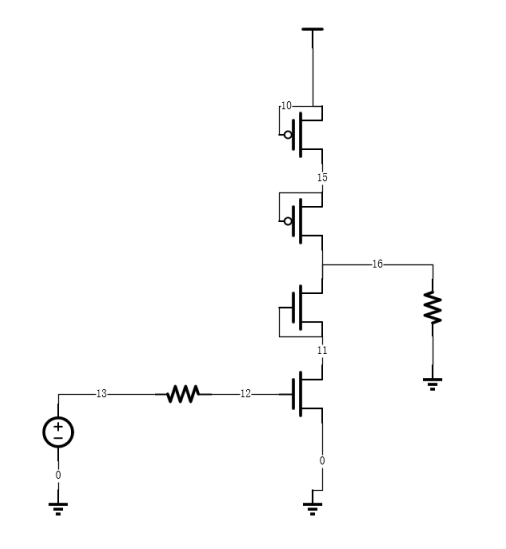

# 模拟EDA SPICE工具

该项目是由复旦大学模拟集成电路设计自动化课程布置的课程作业。项目实现了一个基本的电路 SPICE 工具(Simulation Program with Integrated Circuit Emphasis)，可以对包含 MOSFET（简单的level1模型）、电阻、电容和电感的电路执行 DC 分析以及瞬态分析。

## 项目成员

| 成员名称 | 学号 |
| :----- | :---------: |
| 郑志宇 | 20307130176 |
| 朱瑞宸 |             |
| 林与正 |             |
| 张润洲 |             |

## 功能说明

该工具可以读入电路网表文件，然后执行 DC 分析和瞬态分析，生成对应的输出结果。支持的电路元件包括 MOSFET、电阻器、电容器和电感器。

在 DC 分析中，可以计算电路中各节点的电压和电流。在瞬态分析中，可以计算电路中各节点在一定时间范围内的电压和电流波形。

在 MOSFET 模型中，使用了简化版的 SPICE Level = 1 的 MOS 模型。MOSFET 的源端和漏端不是固定的，需要由两个端口当前的电压值来判断。寄生电容模型中，忽略了 MOS 管模型中寄生电容的非线性特性，假定各寄生电容形式为 $C_{gs}=1/2,~C_{ox}WL=C_{gd},~C_d=C_s=C_{j0}$。

## 用法

### 环境要求

- MATLAB R2020b 或以上版本

### 如何使用

1. 根据要求书写电路网表文件，可以实现以下操作

   - `.dc`，直流电网电路计算

     > 输入示例：
     >
     > .dc

   - `.hb`，AC频率响应分析`暂未实现`

     > 输入示例：
     >
     > `.hb 10e6 30`

   - `.trans`，瞬态响应分析`暂未实现`

     > 输入示例：
     >
     > `.trans total_time step`

   - `.plotnv node `，可以得到节点的电压

     > 输入示例：显示节点的电流
     >
     > `.plotnv 108 `
     >
     > etc.

   - `.plotnc Device(device_port)`，可以得到器件的节点电流

     > 输入示例：显示器件对应的节点的电流
     >
     > `.plotnc M1(d/g/s)`
     >
     > `.plotnc I1(+)`
     >
     > `.plotnc R1(-)`
     >
     > `.plotnc V1(+)`
     >
     > etc.

   - `.MODEL <mosID> VT <Value> MU <Value> COX <Value> LAMBDA <Value> CJ0 <Value>`创建一个MOS管模型，可以根据需求创建不同的MOS管模型，输入要求：MODEL的标号从1开始递增

     > 示例输入：
     >
     > `.MODEL 1 VT -0.75 MU 5e-2 COX 0.3e-4 LAMBDA 0.05 CJ0 4.0e-14`
     > `.MODEL 2 VT 0.83 MU 1.5e-1 COX 0.3e-4 LAMBDA 0.05 CJ0 4.0e-14`

2. 修改Top_module中的filename，在 MATLAB 中运行 `Top_module.m` 脚本得到结果

## 电路网表文件格式

电路网表文件是一个文本文件，格式如下：

要求，文件中`D, M, R, V, C, L, .`都是关键字，在给电阻电容电感命名的时候最好不要使用，避免被错误索引

```css
* non-inverting buffer
VDD 103 0 DC 3
Vin 101 0 SIN 1.5 2 10e6 0
Rin 101 102 10

M1   107 102 103 p 30e-6 0.35e-6 1
M2   107 102 0   n 10e-6 0.35e-6 2
M3   104 107 103 p 60e-6 0.35e-6 1
M4   104 107 0   n 20e-6 0.35e-6 2

C1 104 0 0.1e-12
R2 104 115 25
L1 115 116 0.5e-12
C2 116 0 0.5e-12
R3 116 117 35
L2 117 118 0.5e-12
C3 118 0 1e-12

.MODEL 1 VT -0.75 MU 5e-2 COX 0.3e-4 LAMBDA 0.05 CJ0 4.0e-14
.MODEL 2 VT 0.83 MU 1.5e-1 COX 0.3e-4 LAMBDA 0.05 CJ0 4.0e-14

.dc
.end
```

## 项目的结构

```bash
├── picture # README文档的说明图片
├── projectfile # 项目要求文档
│   ├── HSPICE简明教程(复旦大学).pdf
│   ├── proj1_v02_tj.pdf		
├── testfile # 测试文件目录
│   ├── inverter.sp       		
│   ├── buffer.sp         	
│   ├── lc_filter.sp       	
│   └── amplifier.sp       	
├── Top_module.m
├── parse_netlist.m
├──
├──
├──
├── README.md # 项目说明文件
```

## 项目使用的示例文件

按照标准的电路网表文件进行输入产生电路，然后选择需要查看的端口或者器件的数据信息，选择 DC 或者瞬态仿真或者频率响应分析然后可以得到仿真的图像和数据结果。

## 项目细节介绍

### Part 1 实现电路文件的读取与解析建立矩阵方程

#### 电路文件的信息提取

此功能由郑志宇同学完成

├── parse_netlist.m

##### 函数定义

```matlab
function [RCLINFO, SourceINFO, MOSINFO, DIODEINFO,...
PLOT, SPICEOperation] = parse_netlist(filename);
```

函数完成解析sp文件并提取出有效信息的功能，为后面功能的实现做铺垫。

##### 接口说明

使用哈希表来装参数作为接口在函数中传递。

`RCLINFO`：电阻，电容，电感的信息

```matlab
RCLINFO={RLCName,RLCN1,RLCN2,RLCValue};
```

`SourceINFO`：电源的信息

```matlab
SourceINFO={SourceName,SourceN1,SourceN2,...
Sourcetype,SourceDcValue,SourceAcValue,...
SourceFreq,SourcePhase};
```

`MOSINFO`：MOS管的信息

```matlab
MOSINFO={MOSName,MOSN1,MOSN2,MOSN3,...
MOStype,MOSW,MOSL,MOSID,MOSMODEL};
```

`DIODEINFO`：二极管的信息

```matlab
DIODEINFO={Diodes,DiodeN1,DiodeN2,DiodeID,DIODEModel};
```

`PLOT`：绘图的信息

`SPICEOperation`：电路所需要进行的操作

##### 技术细节

文件主要使用正则表达式在文件中提取和匹配有效的信息并将有效信息打包给其他环节进行处理

#### 节点映射
——zrc

#### 电路初始解的生成
——zrz

#### 器件替换为dc分析网表形式
——zrc

#### 矩阵方程的建立

此功能由郑志宇、林与正同学完成，郑志宇同学写好了初版的线性电路矩阵的生成函数，由林与正同学运用到迭代中去

├── Gen_baseA.m

├── Gen_nextA.m

##### 函数定义

```matlab
%% 处理网表中的所有线性器件生成A、b
function [A,x,b]=Gen_baseA(Name, N1, N2, dependence, Value)
function [A, b] = Gen_nextA(pureA, pureb, Name, N1, N2, dependence, Value)
```

函数接受一个处理好的线性网表的参数，并生成电路的MNA方程

##### 接口说明

`A`：电路矩阵方程，用于求解电路以及迭代

`x`：解空间的命名，用于索引

`b`：`Ax=b`，MNA方程的右边部分

`Name`：器件名

`N1，N2`：线性器件的端口

`dependence`：器件的依赖，用于受控源

`Value`：线性器件的的参数

##### 技术细节

函数实现了计算所有线性元件电路的方法，但是对受控源的书写顺序有一定的要求。即受到依赖的电路元件下标应该小于依赖这一元件的电路元件的下标，防止受控电流源找不到依赖的器件电流。

`I、V、R - 基本的线性电路元件`

`压控电压源 (VCVS) - E`

`压控电流源 (VCCS) - G`

`流控电压源 (CCVS) - H`

`流控电流源 (CCCS) - F`

含有MOS管的电路中只用到了`(VCCS) - G`压控电流源

含有二极管的电路同理

### Part 2 迭代求解电路的直流工作点

### Part 3 实现trans仿真

### Part 4 实现频率响应分析

### Part 5 将电路生成的结果输出

#### `.dc`中输出结果

此功能由郑志宇同学完成

├── portMapping.m

├── ValueCalc.m

##### 函数定义

```matlab
function [plotnv,plotCurrent] = portMapping(PLOT,Node_Map)
function [Obj, res] = ValueCalc(plotnv, plotCurrent, ...
		DCres,x_0, Node_Map, LinerNet, MOSINFO, DIODEINFO)
```

##### 接口说明

`PLOT`：文件中希望绘制的结果信息

`Node_Map`：在前面节点映射的结果

`plotnv, plotCurrent`：电压电流的绘制信息

##### 技术细节

如果想要看一个节点的电压或者某个器件节点的电流在dc中的结果，应该在文件中这样写：

```css
* dc
.plotnv <node>
.dc

* dcsweep
Vin <node1> <node2> DC Value
.plotnv <node>
.dcsweep Vin [1,3] step
```

`ValueCalc`利用迭代计算的结果以及端口映射的结果找到正确的计算值然后返回。


## 项目测试用例

### `.dc`/`.dcsweep`测试用例

#### DC测试用例1 `Amplifier.sp`

##### 网表文件

```css
* Amplifier
VDD 10 0 DC 3
Vin 13 0 DC 0

Rin 13 12 10

Rout 16 0 1000

VB1 18 0 DC 1.5
VB2 17 0 DC 1.5 

M1   15 10 10 p 30e-6 0.35e-6 1
M2   16 18 15 p 60e-6 0.35e-6 1
M3   16 17 11 n 20e-6 0.35e-6 2
M4   11 12 0  n 10e-6 0.35e-6 2

.MODEL 1 VT -0.75 MU 5e-2 COX 0.3e-4 LAMBDA 0.05 CJ0 4.0e-14
.MODEL 2 VT 0.83 MU 1.5e-1 COX 0.3e-4 LAMBDA 0.05 CJ0 4.0e-14

.plotnv 12
.plotnv 16


.dcsweep Vin [0,3] 0.01
```

##### 电路图



#### 运行结果
| 测试变量 | 项目SPICE值 |
| :----- | :---------: |
|         |             |
|         |             |
|         |             |
|         |             |
#### 测试用例2 `bufferSweep.sp`

##### 电路网表

```css
* non-inverting buffer
VDD 103 0 DC 3
Vin 101 0 SIN 1.5 2 10e6 0
Rin 101 102 10

M1   107 102 103 p 30e-6 0.35e-6 1
M2   107 102 0   n 10e-6 0.35e-6 2
M3   104 107 103 p 60e-6 0.35e-6 1
M4   104 107 0   n 20e-6 0.35e-6 2

C1 104 0 0.1e-12
R2 104 115 25
L1 115 116 0.5e-12
C2 116 0 0.5e-12
R3 116 117 35
L2 117 118 0.5e-12
C3 118 0 1e-12

.MODEL 1 VT -0.75 MU 5e-2 COX 0.3e-4 LAMBDA 0.05 CJ0 4.0e-14
.MODEL 2 VT 0.83 MU 1.5e-1 COX 0.3e-4 LAMBDA 0.05 CJ0 4.0e-14

.PLOTNV 102
.PLOTNV 107
.PLOTNV 118

.plotnc M1(d)
.plotnc M3(d)
.plotnc R3(+)

.dcsweep Vin [0,3] 0.01
```

##### 电路图


##### 测试结果图


结果基本符合预期

## 结束语

要注意，我们的项目的仿真工具实现的只是一个较为简单的功能，部分地方细节并不完善，考虑也有欠妥的地方，还有不少改善空间。巴拉巴拉
