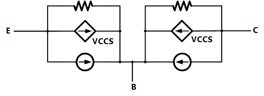
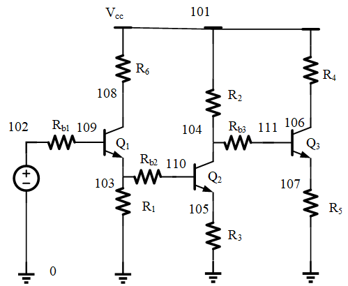

# 基于MATLAB实现的模拟EDA SPICE工具

该项目是由复旦大学模拟集成电路设计自动化课程布置的课程作业。项目实现了一个基本的电路`SPICE` 工具`(Simulation Program with Integrated Circuit Emphasis)`，可以对包含`MOSFET`（简化的`SPICE level1`模型）、二极管（简化的`SPICE level1`模型）、`BJT`（简化的`SPICE EM-1`模型）、电阻、电容和电感的电路执行`DC` 分析、瞬态分析以及`AC`分析。

## 项目成员

| 成员名称 |          学号           |
| :----- |:---------------------:|
| 郑志宇 |      20307130176      |
| 朱瑞宸 |      20300240019      |
| 林与正 |      20307130137      |
| 张润洲 |      19307130046      |

## 项目结构与分工


郑志宇：

- 正则表达式解析文件，搭建顶层模块的框架并定义接口形式
- 生成MNA方程
- shooting_method实现、AC分析实现
- 实现输出节点电压、端口电流

朱瑞宸：

- 生成DC分析网表、生成AC分析网表、生成Trans网表
- 计算零极点功能Gen_PZ
- Hspice器件建模调研，Hspice网表编写，Hspice软件测试、反馈优化和误差分析

林与正：

- 电路DC解迭代求解功能、电路DC扫描功能
- 瞬态仿真功能，瞬态初值与推进过程各两种实现
- Matlab App Design整体打包

张润洲：

## 功能说明

该工具可以读入电路网表文件，然后执行`DC` 分析、瞬态分析、`AC` 分析、零极点分析、稳态分析，生成对应的输出结果。支持的电路元件包括`MOSFET`、二极管、`BJT`、电阻、电容、电感等。

在`MOSFET` 模型中，使用了简化版的`SPICE Level = 1`的`MOS`模型。`MOSFET`的源端和漏端不是固定的，需要由两个端口当前的电压值来判断。

在`Diode`模型中，使用了简化版的`SPICE Level = 1`的`Diode`模型。默认二极管工作在`27℃`下。

在`BJT`模型中，根据`Ebers-Moll` `(EM-1)`模型描述的`I-V`关系得到`BJT`模型的伴随器件。默认双极型晶体管工作在`300K (~27℃)`下。

## 创新点

1. 电流打印。 除了项目提供网表中打印电压的功能，额外完成了电流的输出、索引和打印； 
2. 源漏互换。迭代过程考虑了`MOS`管源漏交换的情况，可以处理输入网表源漏与电路实际源漏情况相反的情况；
3. 二极管仿真。依据`MOS`管迭代求解思路，完成了如二极管、双极型晶体管等其他非线性器件的引入；
4. 直流扫描。在单点`dc`分析的基础上增加了直流扫描的功能，可以以所需步长考察所需端点电压/器件电流随输入电压的变化
4. `AC`扫描。项目实现了`AC`扫描的算法。能对电路进行幅频响应以及相频响应的分析。
4. `shooting_method`使用了一种新的策略来实现。将步长放大并且将误差容限也进行了放大求出了一个周期中收敛的电路解。然后我们将步长缩小，利用`Trans`跑两个周期得到真正的稳态时的电路解，然后再替换掉放大的步长生成的电路解。利用这种方法实现了更快的收敛。
4. 零极点分析。项目实现了对零极点的分析，与`hspice`结果进行了对照。
5. `hspice`仿真分析。利用`hspice`对每个实例电路进行了分析，并通过与查阅的标准`spice`模型对比，进行误差分析、正确性评估与优化
6. 时间复杂度较低。运行`bufferDC.sp`文件，计算直流工作点时，仅用时`0.275s`，主要优化体现在：
   - 迭代更新电路方程的过程使用在不贴入"非线性器件生成的线性器件"得到的矩阵基础上贴入每轮更新的器件值，避免每轮重新生成矩阵或额外空间保留上一轮器件值；
   - 进行节点映射，将节点映射为`0~N`的连续整数，大大降低了查找与遍历的成本
   - 初始解的赋值上，本项目采用了自动化的赋值方法，从初始电压已知的节点`Gnd`和`Vdd(Vcc)`出发，遍历网表中的各个器件，为尽可能多的`MOS`管、二极管、双极型晶体管等非线性器件赋予合理的初始节点电压，以较低的复杂度实现了初始解的赋值
7. 空间利用率较高。主要体现在：
   - `DC`扫描输出利用先生成索引后提取每轮结果的方法，避免消耗大量空间保存最终不需要打印观察的信息
   - 存储数据类型尽量采用矩阵和数字的形式，减少字符的使用，减少变量空间占用的同时也可以减少变量类型转换的时间
   - 接口之间传递数据时直接替换掉用不到的数据。接口之间过程简洁清晰明确。
8. 工程化程度较高。主要体现在：
   - 将项目分成前后端来实现分工与合作，工作大体上分为预处理，网表生成，更新网表迭代，绘制图像这些部分划分，模块之间仅靠接口相互依赖，比较有实际的工程意义
   - 关于项目的接口部分采用了哈希表来实现更快更高效的索引，同时可读性和可扩展性较强，向实际工程靠拢。
   - 关于项目的结构方面，本项目在顶层模块有较高的抽象级，后续容易把项目拓展成有更高的兼容性的项目。

## 用法

### 环境要求

- `MATLAB R2020b` 或以上版本

### 如何使用

1. 根据要求书写电路网表文件，可以实现以下操作

   - `.dc`，直流工作点计算

     > 输入示例：
     >
     > `.dc`

   - `.dcsweep`，直流扫描，生成转移曲线

     > 输入示例：
     >
     > `.dcsweep Vin [0,3] 0.01`

   - `.pz`，零极点分析

     > 输入示例：
     >
     > `.pz`
     >
     > `plot <node>`
     
   - `.ac`，AC频率响应分析

     > 输入示例：
     >
     > 输入支持科学计数法
     >
     > `.ac DEC 10 1K 1e15MEG`
     >
     > `.ac LIN 100 1K 100HZ`

   - `.trans`，瞬态响应分析

     > 输入示例：
     >
     > `.trans total_time step`

   - `.shoot`，打靶法寻找稳态响应

     > 输入示例：
     >
     > `.shoot step`
     
   - `.plotnv node `，可以得到节点的电压

     > 输入示例：显示节点的电压值
     >
     > `.plotnv 108 `
     >
     > etc.

   - `.plotnc Device(device_port)`，可以得到器件的节点电流

     > 输入示例：显示器件对应的节点的电流
     >
     > `.plotnc M1(d/g/s)`
     >
     > `.plotnc I1(+)`
     >
     > `.plotnc R1(-)`
     >
     > `.plotnc V1(+)`
     >
     > etc.

   - `.MODEL <mosID> VT <Value> MU <Value> COX <Value> LAMBDA <Value> CJ0 <Value>`创建一个MOS管模型，可以根据需求创建不同的MOS管模型，输入要求：MODEL的标号从1开始递增

     > 示例输入：
     >
     > `.MODEL 1 VT -0.75 MU 5e-2 COX 0.3e-4 LAMBDA 0.05 CJ0 4.0e-14`
     > `.MODEL 2 VT 0.83 MU 1.5e-1 COX 0.3e-4 LAMBDA 0.05 CJ0 4.0e-14`
     
   - `.DIODE <diodeID> Is <Value>`创建一个二极管模型，可以根据需求创建不同的二极管模型，输入要求：MODEL的标号从1开始递增

     > 示例输入：
     >
     > `.DIODE 1 Is 1e-5`
     
   - `.BIPOLAR <bjtID> Js <Value> alpha_f <Value> alpha_r <Value> Cje <Value> Cjc <Value>`创建一个双极型晶体管模型，可以根据需求创建不同的双极型晶体管模型，输入要求：MODEL的标号从1开始递增

     > 示例输入：
     >
     > `.BIPOLAR 1 Js 1e-16 alpha_f 0.9981 alpha_r 0.981 Cje 1e-12 Cjc 1e-12`

3. 修改`Top_module`中的`file`，在`MATLAB`中运行`Top_module.m` 脚本得到仿真的结果。

## 电路网表文件格式

电路网表文件是一个文本文件，格式如下：

要求，文件中`D, M, R, V, C, L, .`等都是关键字，而且需要尽量避免器件之间的名字出现相互包含的情况，避免被错误识别

```css
* non-inverting buffer
VDD 103 0 DC 3
Vin 101 0 SIN 1.5 2 10e6 0
Rin 101 102 10

M1   107 102 103 p 30e-6 0.35e-6 1
M2   107 102 0   n 10e-6 0.35e-6 2
M3   104 107 103 p 60e-6 0.35e-6 1
M4   104 107 0   n 20e-6 0.35e-6 2

C1 104 0 0.1e-12
R2 104 115 25
L1 115 116 0.5e-12
C2 116 0 0.5e-12
R3 116 117 35
L2 117 118 0.5e-12
C3 118 0 1e-12

.MODEL 1 VT -0.75 MU 5e-2 COX 0.3e-4 LAMBDA 0.05 CJ0 4.0e-14
.MODEL 2 VT 0.83 MU 1.5e-1 COX 0.3e-4 LAMBDA 0.05 CJ0 4.0e-14

.dc
.end
```

## 项目的结构

```bash
FUDAN_ANALOG_EDA_MATLAB_SPICE
### 项目主文件目录
├── Top_module.m
├── parse_netlist.m
│   ├── compCINFO.m
│   └── tranNumber.m
├── Generate_DCnetlist.m
│   ├── Gen_NodeInfo.m
│   ├── Gen_DeviceInfo.m
│   ├── init_value.m
│   ├── Mos_Calculator.m
│   ├── Diode_Calculator.m
│   └── BJT_Calculator.m
├── CalculateDC.m
│   ├── Gen_nextRes.m
│   │   ├── Mos_Calculator.m
│   │   ├── Diode_Calculator.m
│   │   └── BJT_Calculator.m
│   ├── Gen_baseA.m
│   └── Gen_nextA.m
├── Sweep_DC.m
├── Generate_ACnetlist.m
│   ├── Mos_Calculator.m
│   ├── Diode_Calculator.m
│   └── BJT_Calculator.m
├── Sweep_AC.m
│   ├── Gen_ACmatrix.m
│   └── Gen_NextACmatrix.m
├── Generate_transnetlist.m
│   ├── Gen_NodeInfo.m
│   ├── Gen_DeviceInfo.m
│   ├── Sin_Calculator.m
│   ├── Mos_Calculator.m
│   ├── Diode_Calculator.m
│   └── BJT_Calculator.m
├── CalculateTrans.m
│   ├── Sin_Calculator.m
│   ├── TransInitial.m
│   ├── TransInitial_byDC.m
│   ├── TransTR_fix.m
│   └── TransBE_Dynamic.m
├── Gen_PZ.m
├── shooting_method.m
│   ├── TranInit.m
│   └── Trans.m
├── portMapping.m
├── ValueCalc.m
├── getCurrent.m
│   ├── getCurrentAC.m
│   ├── getCurrentDC.m
│   └── getCurrentTrans.m
├── calcCurrent.m
├── LU_solve.m
│   ├── LU_decompose.m
│   └── sparse_LU_decompose.m
├── SpM.m
#### 项目文档
├── README.md 
#### 展示PPT
├── 基于MATLAB实现的模拟电路SPICE工具.pptx 
├── picture # README图片以及程序图片输出位置
├── projectfile # 参考资料
│   ├── HspiceManual完全手册.pdf
│   ├── hspice_mosfet.pdf
│   ├── hspice_sa.pdf
│   ├── HSPICE简明教程(复旦大学).pdf
│   ├── A Streaming Dataflow Engine for SpMVM Using HLS.pdf
│   └── proj1_v03_tj.pdf
└── testfile # 测试文件目录
    ├── test_hspice  # hspice测试文件目录
    ├── test_ori    # 课程示例文件目录
    ├── Amplifier.sp
    ├── AmplifierDC.sp
    ├── AmplifierSweep.sp
    ├── bjtAmplifierAC.sp
    ├── bjtAmplifierDC.sp
    ├── bjtAmplifierShoot.sp   
    ├── bjtAmplifierSweep.sp
    ├── bjtAmplifierTrans.sp
    ├── bjtAmplifier2DC.sp
    ├── bjtAmplifier3DC.sp   
    ├── buffer.sp
    ├── bufferAC.sp
    ├── bufferDC.sp
    ├── bufferPZ.sp
    ├── bufferShoot.sp
    ├── bufferSweep.sp
    ├── bufferTrans.sp
    ├── dbmixer.sp
    ├── dbmixerAC.sp
    ├── dbmixerDC.sp
    ├── dbmixerTrans.sp
    ├── diftest.sp
    ├── diftestDC.sp
    ├── diftestShoot.sp
    ├── diftestSweep.sp
    ├── diftestTrans.sp
    ├── invertbufferDC.sp
    ├── invertbufferSweep.sp
    ├── RC.sp
    ├── RCLPZ.sp
    ├── RCPZ.sp
    ├── RC_V3.sp
    ├── SmosAC.sp
    └── SmosPZ.sp
```

## 项目细节介绍

### 项目顶层文件与接口的定义

此部分由郑志宇同学维护，接口与功能与小组成员共同商议确定。最终实现了项目的并行推进与项目成员对函数的独立维护。

```bash
├── Top_module.m
```


#### 顶层的实现

```matlab
%% 项目的顶层模块，用于实现整个项目的仿真流程
% 此文件为项目搭建的顶层架构，用于梳理和切割项目实现的功能并实现模块化
%% 读取文件，预处理阶段
filename = 'testfile\bufferSweep.sp';
%% 网表的解析
parse_netlist;
%% 生成线性网表
Generate_DCnetlist;
%% 根据读到的操作选择执行任务的分支
switch lower(SPICEOperation{1}{1})
    case '.dcsweep'
    %% DCSEWEEP操作的流程
    case '.ac'
    %% AC分析的流程
    case '.trans'
    %% 瞬态仿真的流程
    case '.dc'
    %% DC分析的流程
    case '.pz'
    %% 零极点分析
    case '.shoot'
    %% 瞬态仿真shooting_method的流程
end

```

#### 顶层模块的流程

顶层模块遵循可读性高，流程清晰的原则进行书写。我们的基本思路是：

- 读取电路文件网表，根据网表文件读取并处理信息
- 对读取到的信息进行预处理，得到迭代所需要的网表
- 针对不同的`SPICE`操作进行处理，迭代得到电路的解
- 对电路的解进行输出

### Part 1 实现电路文件的读取与解析建立矩阵方程

#### 电路文件的信息提取 - `parse_netlist`

此功能由郑志宇同学完成

```bash
├── parse_netlist.m
```

##### 函数定义

```matlab
function [RCLINFO, SourceINFO, MOSINFO, DIODEINFO, BJTINFO...
PLOT, SPICEOperation] = parse_netlist(filename);
```

此函数是文件的接口，完成了解析`sp`文件并提取出有效信息的功能，为后面功能的实现做铺垫。

##### 接口说明

1. 函数输入

   - 文件名 -`filename`

2. 函数输出

   - `RCLINFO`：电阻，电容，电感的信息

     ```matlab
     RCLINFO={RINFO,CINFO,LINFO};
     %% RINFO,CINFO,LINFO都是如下所示的结构
     RINFO={Name,N1,N2,Value}
     ```

   - `SourceINFO`：电源的信息

     ```matlab
     SourceINFO={SourceName,SourceN1,SourceN2,...
     Sourcetype,SourceDcValue,SourceAcValue,...
     SourceFreq,SourcePhase};
     ```

   - `MOSINFO`：MOS管的信息

     ```matlab
     MOSINFO={MOSName,MOSN1,MOSN2,MOSN3,...
     MOStype,MOSW,MOSL,MOSID,MOSMODEL};
     ```

   - `DIODEINFO`：二极管的信息

     ```matlab
     DIODEINFO={Diodes,DiodeN1,DiodeN2,DiodeID,DIODEModel};
     ```
   - `BJTINFO`：双极型晶体管的信息

     ```matlab
     BJTINFO={BJTName,BJTN1,BJTN2,BJTN3,...
     BJTtype,BJTJunctionarea,BJTID,BJTMODEL});
     ```
     
   - `PLOT`：需要进行绘图的信息

   - `SPICEOperation`：电路所需要进行的操作

##### 技术细节

本部分使用了**哈希表**来装参数作为接口在函数中传递，加快了运行的速度，提高运行效率。函数主要使用**正则表达式**在文件中提取和匹配有效的信息并将有效信息打包给其他环节进行处理。这一部分在项目的开始阶段进行，为项目的实现**搭建了一个整体的框架**，同时**定义了输入与输出的接口要求**，以便于团队合作化工作以及推进。

同时，为了处理`MOS`管和`BJT`引入的寄生电容，`parse_netlist`函数中引入了`compCINFO`函数来实现寄生电容参数的提取。其中，`BJT`的寄生电容值与`VBE`、`VBC`的值有关，因此需要在`Generate_ACnetlist`函数中更新`BJT`的寄生电容值。

#### 生成`DC`网表 -`Generate_DCnetlist`
此功能由朱瑞宸同学完成

├── Generate_DCnetlist.m

本函数包含节点映射、初始解生成和DC网表生成三个功能，其中初始解生成部分功能单独打包为以下函数，在上主函数中调用：

├── Gen_NodeInfo.m

├── Gen_DeviceInfo.m 

├── init_value.m

生成压缩节点形式的DC网表的函数功能打包为以下函数，在主函数中调用：

├── Node_Mapping_DC.m

其余通用节点映射功能和DC网表生成功能直接实现在主函数之中

##### 函数定义

```matlab
function [LinerNet,MOSINFO,DIODEINFO,BJTINFO,Node_Map]=...
    Generate_DCnetlist(RCLINFO,SourceINFO,MOSINFO,DIODEINFO,BJTINFO)
```

函数根据dc分析所需要的网表形式，将节点映射为从0开始的序号，便于后续统计器件等数目。将各个器件的节点和值等信息从元胞数组中提取出，完成类型转换。根据初始解将器件按照牛顿迭代法的思路依次替换为线性元件，交给后续生成矩阵和迭代求解。

##### 接口说明

部分变量类型发生转化，同样使用哈希表来装参数作为接口在函数中传递。

`LinerNet`：完成替换后的线性元件信息

```matlab
LinerNet={Name,N1,N2,dependence,Value,MOSLine};
```

`MOSINFO`：MOS管详细参数信息,其中MOSLine表示替换的线性元件中MOS管所在行数

```matlab
MOSINFO={Name,MODEL,type,W,L,ID,MOSLine}
```

`DIODEINFO`：二极管详细参数信息

```matlab
DIODEINFO={Name,MODEL,IS,DiodeLine}
```

`BJTINFO`：双极型晶体管详细参数信息

```matlab
BJTINFO={Name,MODEL,type,JS,Junctionarea,ID,BJTLine}
```

`Node_Map`：节点映射向量

```matlab
Node_Map double n*1
```

##### 技术细节

本部分收将所有变量从哈希表中提取出来，将可以用数值表示的转化为double的形式，便于后续识别和带入具体计算。

#### 节点映射  -`Node_Mapping`
此功能由朱瑞宸同学完成

为了降低节点遍历成本，将节点序号映射为连续的1~N，映射关系储存在向量Node_Map中，从而提高运行速度。

##### 通用节点映射

将提取到的所有节点信息储存为一个节点信息向量中， 调用matlab的unique函数完成重复元素删除和由小到大排序。经此处理，除了地(0)之外，实现了其余所有节点到连续1~N的一一对应的映射。注意，这里电容和电感的原有节点都得到保留，虽然在DC分析下，电感短路，两个节点实际为一个节点，这增加了DC分析的NMA矩阵维数，但是考虑到后续瞬态仿真和AC分析的一致性，这里采用的直接映射则可以重复使用，更具通用性。

##### DC压缩节点映射

生成DC压缩结点的网表，主要对电容和电感进行特殊处理。由于压缩节点后，电感两端的两个节点合并为一个节点，因此不再是一一对应的关系,Node_Map变为N*2的矩阵，第一列表示原端口序号，第二列为其映射后相应的端口序号。

├── Node_Mapping_DC.m

###### 函数定义

```matlab
function [Node_Map_DC]=Node_Mapping_DC(NodeDC,NodeL,LN1,LN2)
```

###### 接口说明

1. 函数输入
    - `NodeDC`：去除电容后，所有原有节点映射完成后的存储向量
    - `NodeL`：电容相关节点映射完成后的存储向量
    - `LN1`、`LN2`：原有的每个电感两端的节点序号信息
2. 函数输出
    - `Node_Map`：节点映射向量，n*2的矩阵，第一列表示原有端口序号，第二列表示现有端口序号

###### 技术细节

- 电容：直接剔除电容附加的节点信息。尽管在DC分析中，电容视为电流为0的独立电流源，并不会对MNA矩阵带来复杂度的增加，但是若一个节点与之相连的器件均为电容，则从DC分析的角度来看，该节点为一浮空节点，其电压值无法确定。若不加剔除直接放入MNA方程，则该冗余节点会造成NMA方程不满秩，对求解的稳定性带来隐患。

- 电感：使用并查集实现节点合并。由于在matlab中没有指针，因此并查集使用n*2矩阵的方式实现。矩阵第一列表示所有电感节点的原有序号，第二列表示其父节点(0表示根节点)。然后根据LN1和LN2的信息遍历，视LN1(i)节点为LN2(i)结点的父节点。同时:
  - 若LN1(i)不为根节点，将LN2(i)压缩路径直接继承到根节点下。
  - 若LN2(i)不为孤立节点,先查找其父节点，再根据所在根节点查找所有子节点，最后都继承到LN1(i)根或其根节点下
  
  从而通过以上步骤完成并查集的建立。然后新建一一对应的N*2的所有节点的映射表，再根据并查集将所有子节点的序号换位为根节点的序号。最后为了保证映射后节点序号连续，再将映射后的节点向量取出，调用unique函数映射到连续的0~N,再根据映射关系完成映射后节点序号的替换。

###### 效果展示

对于BufferDC电路(bufferDC.sp)

采用通用节点映射得到的Node_Map:

$$\begin{bmatrix}
0\\
101\\
102\\
103\\
104\\
107\\
115\\
116\\
117\\
118\\
\end{bmatrix}$$

采用压缩节点映射得到的Node_Map:

$$\begin{bmatrix}
0&0\\
101&1\\
102&2\\
103&3\\
104&4\\
107&5\\
115&6\\
116&6\\
117&7\\
118&7\\
\end{bmatrix}$$

可以看到，节点规模由10降到了8，降低了MNA矩阵的维数


#### 电路初始解的生成 - `init_value`
此功能由张润洲同学完成。

在对非线性电路进行瞬态仿真或`AC`仿真前，一般需要先进行`DC`仿真。线性电路的DC分析可以直接通过求解矩阵方程得到结果，而非线性电路的`DC`分析等同于求解超越方程组，需要为程序提供一组各个待求变量的初始解，程序以这组初值为基础开始数值迭代运算。如果没有为非线性电路提供初始解，或初始解估计不准，则会导致`DC`分析的计算时间增加，甚至会解出不合适的解 (比如`SRAM`单元、环形振荡器等多稳态电路的`DC`分析)。

给出电路初始解的思路可以分为手工进行`DC`分析和自动化给定初始解等。手工进行`DC`分析需要将`L`的初始电流、`C`的初始电压、`MOS`与二极管以及双极型晶体管等器件的初始电压设置为手工分析得到的直流解，或者将上述电流、电压量设置为一个较为合理的猜测的值再进行`DC`分析，这样做手工分析的工作量有所减少，但初始解同样不是自动化给出的。

本项目选择自动化给定初始解的方法，采用程序`init_value.m`给定初始解。得到初始解后，`Generate_DCnetlist`函数利用初始解生成第`1`次NR迭代前伴随器件应“贴”入`MNA`方程的值 (`MOS`管、二极管、双极型晶体管分别对应`3`个、`2`个、`6`个伴随器件)，`Gen_baseA`函数将所有非伴随器件的值贴入`MNA`方程，之后每轮迭代调用一次`Gen_nextRes`函数将这一轮迭代的伴随器件值贴入`MNA`方程，直至迭代完成。

##### 初始解赋值思路

1. 找**源极接`Gnd`的`NMOS`管 (源极接`Vdd`的`PMOS`管)**，如果`MOS`管的节点已赋过值 (在`NodeInfo`中查找到的`value`为正值，不为`-1`) 则跳过该节点，否则为这些`MOS`管的源极电压赋值为`0`或`Vdd`，`|Vgs|`赋为`Vdd*2/3`, `|Vds|`赋为`Vdd/2`；

   找**发射极接`Gnd`的`npn`型`BJT`管 (发射极接`Vcc`的`pnp`型`BJT`管)**，如果`BJT`管的节点已赋过值 (在`NodeInfo`中查找到的`value`为正值，不为`-1`) 则跳过该节点，否则为这些`BJT`管的发射极电压赋值为`0`或`Vcc`，`|Vbe|`赋为`0.7V`，`|Vce|`赋为`0.1V`；

2. 找**源极未连接`Gnd`的`NMOS`管 (源极未连接`Vdd`的`PMOS`管)**，如果`MOS`管的节点已赋过值则跳过该节点，否则和上述`MOS`管赋一样的`|Vgs|`和`|Vds|`；

   找**发射极未连接`Gnd`的`npn`型`BJT`管 (发射极未连接`Vcc`的`pnp`型`BJT`管)**，如果`BJT`管的节点已赋过值则跳过该节点，否则和上述`BJT`管赋一样的`|Vbe|`和`|Vce|`；

3. 找**直流电压源**，如果电压源的`2`个节点已赋过值则跳过该器件；如果电压源与`Gnd`或`Vdd (Vcc)` 相连，或者电压源的`1`个节点已赋过值，将另`1`个节点赋值以使得器件两端电压为电压源的直流电压值 (该值可以从`DeviceInfo`元胞数组中查到)；如果电压源的`2`个节点都未赋值，将电压源的第`2`个节点电压赋为`0`，将第`1`个节点电压赋为电压源的直流电压值；
4. 找**有节点接`Gnd`的其他非`NMOS`非`npn`型`BJT`器件** (均为二端器件)，如果该器件的另`1`节点未连接`Vdd`，则先赋值为`0`；
5. 找**有节点接`Vdd`的其他非`PMOS`非`pnp`型`BJT`器件** (均为二端器件)，将该器件的另`1`节点赋值为`Vdd`；
6. 其他器件：如果是**二极管**，为帮助收敛，设置其两端电压为`0.7V`；如果是电阻等器件，若节点没有赋过初值，则赋电压为`Vdd/2`.

##### `init_value`函数输入输出

```matlab
function [x_0] = init_value(NodeInfo, DeviceInfo, Vdd, Vdd_node, Gnd_node)
```

`init_value`函数采用`2`重循环，先遍历各个器件，再遍历每个器件的各个节点。遍历器件需要`DeviceInfo`元胞数组的信息，遍历器件节点并赋节点电压初始值时需要`NodeInfo`元胞数组的信息

`DeviceInfo`：存储电路器件信息的`cell`

`DeviceInfo`元胞数组是在`Generate_DCnetlist.m`中通过调用`Gen_DeviceInfo`函数赋值的，该数组存储了各器件名称、类型、相连节点、是否初始化、电压源的直流值等信息

`NodeInfo`：存储电路节点信息的`cell`

`NodeInfo`元胞数组是在`Generate_DCnetlist.m`中通过调用`Gen_NodeInfo`函数赋值的，该数组存储了各节点的初始值信息

`zp`：节点电压初始解向量，存储`NodeInfo`元胞数组中的初始值信息

```matlab
x_0(i) = NodeInfo{i}.value;
```

初始解函数只需要给出节点电压初始值，不需要为`MNA`方程中的电流变量提供初值后续迭代也可以收敛。

##### `init_value`函数备注

1. 计算初始解的函数认为，电路网表文件中的第一个直流电压源是`Vdd (Vcc)`

2. 初始解只能尽量满足各个器件的节点电压赋值要求 (包括`MOS`管的`|Vgs|`与`|Vds|`，电压源的两端节点电压等)

3. 需要注意的是，初始解的作用主要是加快迭代过程的收敛速度。对于电路中的非线性器件，可以采用初始解来给定它们的初始工作状态，但难免会遇到部分非线性器件初始工作状态为截止区的情况，进而可能导致电路仿真无法收敛。因此，最好能给定固定初值，以使各个非线性器件在第`1`轮迭代时都能正常导通，而不是使用初始解来确定各个器件的初始工作状态。

   在仿真测试时，我们发现，`MOS`和`Diode`通过初始解确定初始工作状态的话一般能在仿真迭代时收敛，而`BJT`的要求比较苛刻。单管`BJT`电路可以采用初始解给定初始工作状态的方式得到收敛的仿真结果，但在多管`BJT`电路中则不能收敛，而在多管`BJT`与`Diode`一起仿真时`Diode`的初始工作状态如果由初始解给定也不能收敛。后续还需要更好的初始解计算方法来给定更合适的非线性器件初始工作状态。

   下面是可以采用的一种赋值方案，可以应用于`Generate_DCnetlist`、`Generate_transnetlist`与`Generate_ACnetlist`中：

   ```bash
   ├── NMOS
   │   ├── VDS = 3V
   │   └── VGS = 1V
   ├── PMOS
   │   ├── VDS = -3V
   │   └── VGS = -1V
   ├── Diode
   │   └── Vpn = 0.66V
   ├── NPN BJT
   │   ├── VBE = 0.7V
   │   └── VBC = 0.1V
   ├── PNP BJT
   │   ├── VBE = -0.7V
   │   └── VBC = -0.1V
   ```

##### 初始解可能的优化方法

1. 采用瞬态分析得到初始解

   可以将直流分析的输入电压源视为具有较长上升时间的斜坡输入信号，将所有节点电压初始化为零后进行`1`次瞬态分析。使用本次瞬态分析结束时刻的解作为`DC`分析的初始解。瞬态分析需要将`L`、`C`计入，算法复杂度较高，而`DC`分析中`L`、`C`都得到了简化，求解初始解的时间相对整个`DC`分析过程占比较大，但是通过这种方法得到的初始解准确，同时可以直接根据瞬态分析得到的初始解判断输入电路是否合理。

   在瞬态分析的过程中可以采用这种方法给定初始解。

2. 采用随机初始解

   通过大量随机初始解可以测得几组可能的收敛解，从中选出合理的收敛解。这种方法得到也能得到更准确的`DC`分析结果，通过多次运行`DC`分析避免了对初始解的依赖，但多次运行`DC`算法复杂度高；同时还需要从多组解中人工选出合理的解，没有完全实现初始解的自动化给定。
   
#### 器件替换与网表生成 -`Calculator`
此功能由朱瑞宸同学完成

本部分功能为将所有器件按照`DC`分析的要求进行相应处理，将其全部替换为只含有电阻、独立源和受控源的形式，从而可以贴入`MNA`方程中进行迭代求解。

##### 功能处理思路

根据器件类型不同进行不同处理：

###### `RLC` :

对于电阻`R`，保持不变；电容`C`替换为电流为`0`的独立电流源；电感`L`替换为电压为`0`的独立电压源。

###### 独立源 :

保持不变

###### `MOS`： 

首先，对于非线性元件的处理，本项目目前采用牛顿迭代法的方法进行。因此，对于`MOS`器件，按照牛顿迭代法得到的递推式，将`MOS`管等效成`d`、`s`两极之间的独立电流源、电阻和受`Vgs`控制的压控电压源的并联的形式。

其次，由于`MOS`器件的源漏对称性，在简单的`level1`模型中，并不特别处理源端和漏端的区别，因此在实际工作的时候，器件存在源极和漏极互换的可能性。比如若`NMOS`源极关闭，漏极打开，此时电路依然可以得到一个由源极流向漏极的电流，此电流受到`Vgd`控制。因此，为了考虑`MOS`源漏互换的情况，在替换`MOS`为线性伴随器件时，需要提前根据`mos`的源漏电压判断哪边是实际意义上的“源极”，哪边是实际意义上的“漏极”。根据判断结果不同，引入一个临时变量`flag`，当源漏与原本网表一致时为`1`，当源漏互换时为`-1`，从而判断电流方向不同以及受控源的控制端子不同。

另外，为了区分`MOS`器件替换出来的线性元件与原本就在电路中存在的线性元件，决定哪些部分需要随着迭代过程更新，哪些部分不变，我们采取了两个措施：一是将`MOS`管替换出来的线性元件的命名规定为`"R/L/C+Mosname"`，从而可以根据名字的第二个字母判断是否是`MOS`器件生成的线性元件；二是在填写`DC`分析网表的过程中先填入原本存在的线性元件，后填入替换非线性元件产生的线性元件，记录下开始填入非线性元件产生的线性元件的初始行数`MOSLine`，从而可以快速定位到需要替换的器件处。

###### 二极管器件：

二极管器件的处理思路同`MOS`器件，根据牛顿迭代法得到的递推式，将其等效为独立电流源与电阻的并联。同时记录下线性元件开始替换的行数`DiodeLine`，从而在之后的迭代过程中快速定位替换。

###### 双极型晶体管器件：

双极型晶体管器件的处理思路是根据`EM-1`模型`I-V`关系代入牛顿迭代法得到的递推式，将其等效为独立电流源、电阻与压控电流源的并联，一共有`6`个线性伴随器件。同时记录下线性元件开始替换的行数`BJTLine`，从而可以在之后的迭代过程中快速定位到需要替换的器件处。

需要注意的是，`BJT`有多种不同的利用伴随器件求解的方法。比如根据`EM-1`模型给出的表达式，可以将`1`个`BJT`等价为`2`个`Diode`和`2`个`CCCS`：


我们采用了更简单的伴随器件组合，即按照`MOS`和`Diode`的伴随器件求解思路对非线性器件的控制电压量求导，可以将`1`个`BJT`等价为`2`个电阻、`2`个`VCCS`和`2`个电流源：



##### 计算模块打包

根据牛顿迭代法得到的递推式，我们需要根据非线性元件的原本性能参数和此时元件端口的电压关系得到替换后线性元件的相应的值。由于在之后的迭代过程中，这样的操作依然需要多次重复，因此我们将根据非线性元件参数、非线性元件端口电压得到替换线性元件值的功能打包为以下函数，在之后的迭代过程中依然可以继续使用：

```bash
├── Mos_Calculator.m
├── Diode_Calculator.m
└── BJT_Calculator.m
```

###### 函数定义
计算`MOS`器件线性参数：
```matlab
function [Ikk,GMk,GDSk] = Mos_Calculator (VDSk,VGSk,Mosarg,W,L)
```
计算二极管器件线性参数：
```matlab
function [Gdk, Ieqk] = Diode_Calculator(Vpn, Is, T)
```
计算`BJT`器件线性参数：
```matlab
function [Rbe_k, Gbc_e_k, Ieq_k, Rbc_k, Gbe_c_k, Icq_k] = BJT_Calculator(VBE, VBC, BJTarg, BJTJunctionarea, BJTflag, T)
```

###### 接口说明

 `VDSk、VGSk、Vpn、VBE、VBC`：非线性器件的端口之间的电压差

 `Mosarg、Is、BJTarg、BJTJunctionarea`：非线性器件的固有参数

 `W、L、T`：非线性器件会根据实际情况调整的参数，如mos管的长宽、二极管工作的温度

 `Ikk、GMk、GDSk、Gdk, Ieqk、Rbe_k、Gbc_e_k、Ieq_k、Rbc_k、Gbe_c_k、Icq_k`：相应得到的线性元件的值，如电阻阻值，电流源电流、受控源转移系数

###### 技术细节

本部分需要额外注意变量类型，如向量方向、`cell`、`mat`、`double`等类型之间的转换。最后也将所有输出的值打包为哈希表的形式传给后级

#### 矩阵方程的建立 -`Gen_Matrix`

此功能由郑志宇、林与正同学完成，郑志宇同学写好了初版的线性电路矩阵的生成函数，由林与正同学运用到迭代中去

```bash
├── Gen_Matrix.m
├── Gen_ACmatrix.m
└── Gen_nextACmatrix.m
```

##### 函数定义

```matlab
%% 处理网表中的所有线性器件生成A、b
function [A,x,b] = Gen_Matrix(Name, N1, N2, dependence, Value)
```

函数接受一个处理好的线性网表的参数，并生成电路的`MNA`方程

##### 接口说明

1. 函数输入
   - `Name`：器件名
   - `N1，N2`：线性器件的端口
   - `dependence`：器件的依赖，用于受控源
   - `Value`：线性器件的的参数值
2. 函数输出
   - `A`：电路矩阵方程，用于求解电路以及迭代
   - `x`：解空间的命名，用于索引
   - `b`：`Ax=b`，MNA方程的右边部分

##### 技术细节

这个函数虽然在前端处理与后端计算的中间，但实际上却是率先完成的部分。因为这个函数相对其他过程比较独立，接受的器件的形式也是基本确定的。

**函数实现了计算所有线性元件电路的方法，但是对受控源的书写顺序有一定的要求。即受到依赖的电路元件下标应该小于依赖这一元件的电路元件的下标，防止受控电流源找不到依赖的器件电流。**

生成MNA方程的代码使用了尽可能清晰简单的逻辑，在生成矩阵的时候我们首先是考虑地节点的，保证代码逻辑的一致性，随后去掉了接地的节点以及接地节点的电压来求解矩阵方程，因为接地的节点并不影响方程的求解，同时减少矩阵的维度有益于加快运算的效率。

线性网表包含以下器件：

1. `I、V、R - 基本的线性电路元件`：基本的线性电路元件的处理思路就是直接在对应的端口列上节点电流方程。

2. `压控电压源 (VCVS) - E`：压控电压源的依赖是端口电压，所以能直接在受控的端口生成一个电流，然后在受控端口加上电流的条件。

3. `压控电流源 (VCCS) - G`：压控电流源更加直接，不需要新建电流，电压本身就转化成了电流的关系。

4. `流控电压源 (CCVS) - H`：流控电压源相对复杂，需要引入两个电流关系，在控制器件处生成一个电流方程，还需要在受控器件处生成一个电流量。

5. `流控电流源 (CCCS) - F`：与流控电压源类似，但不同的是不需要在受控的端口再生成电流，只需要一个额外的方程即可。

含有MOS管的电路中只用到了`(VCCS) - G`压控电流源

含有二极管的电路同理

#### 线性求解器 - `LU`分解

此功能由张润洲同学完成

```bash
├── LU_solve.m
└── LU_decompose.m
```

##### 函数定义

```matlab
%% 利用LU分解求解线性方程组的解
function [v] = LU_solve(Y, J)
```

```matlab
%% LU分解
function [L,U,P] = LU_decompose(Y)
```

##### 技术细节

`MATLAB`本身提供了带有许多优化细节的线性求解器，直接利用`v = Y\J`的方式可以得到线性方程组的解，而且速度比自己实现的`LU`分解方法快很多，但是这种求解方法的缺点是无法采用稀疏矩阵存储格式对算法的空间复杂度进行优化。因此，我们考虑实现`MATLAB`的`LU`分解线性求解器，为进一步引入稀疏矩阵格式的线性求解器打下基础。

利用`LU`分解求解线性方程组的思路是对系数矩阵`Y`做`LU`分解后，利用`1`次前向替换与`1`次后向替换求得线性方程组的解。在实现`LU`分解的过程中，需要注意的点有：

1. `LU`分解可以应用于非方阵，但`MNA`方程的系数矩阵一定是方阵，所以此处`LU`分解的实现过程可以简化；
2. `MATLAB`实现`LU`分解的过程中用到了列主元消元法，采用方阵`P`记录行交换的过程。在调用`LU_decompose`或`MATLAB`内置的`lu`方法求得`L`、`U`、`P`三项后，需要将方程组右边的常数向量`J`替换为`P*J`；
3. 在做行交换操作时，需要改的方阵除了`Y`、`P`外，还有`LU`分解得到的下三角矩阵`L`的已计算部分也需要修改，这个点在实现`LU`分解的过程中是最后发现的问题，是在将自己实现的`LU`分解应用于`1`个`3×3`的小方阵后才发现这个点的

#### 稀疏矩阵格式的线性求解器 - `SpM`类

此功能由张润洲同学完成

```bash
├── SpM.m
└── Sparse_LU_decompose.m
```

##### 稀疏矩阵格式

常见的稀疏矩阵存储格式有`COO`、`CSR`、`CSC`、`MCSR`等等。以下列矩阵为例说明以上几种存储格式。

一般格式存储的矩阵如下，该`5×5`稀疏矩阵中共有`7`个`NZ (non-zero)`元素。由于`MNA`方程的系数矩阵一定是方阵，这里选取了一个方阵例子，记其行数`rows = 5`，`NZ`元素数`NNZ = 7`。

```bash
2 0 0 1 0
0 0 0 0 0
0 0 0 6 0
0 0 0 1 4
0 2 0 1 0
```

以`COO`格式存储的数据如下，其中`row_index`与`col_index`等与索引有关的量均采用了`MATLAB`的要求从`1`开始，如果采用其他语言需要做相应修改。`COO`格式的数据中，`row_index`、`col_index`与`value`数组的长度均等于`NNZ`，它们分别记录了`NZ`元素的行坐标、列坐标与数值。

```bash
row_index = [1 1 3 4 4 5 5]
col_index = [1 4 4 4 5 2 4]
value = [2 1 6 1 4 2 1]
```

以`CSR`格式存储的数据如下，其中`row_index`的长度等于`rows + 1`，`row_index`数组记录了每一行的`NZ`元素信息在`col_index`与`value`数组中的位置，比如`row_index`的第`4`和第`5`个元素是`4`和`6`，说明第`4`行的`NZ`元素信息在`col_index`与`value`数组中的`[4,6)`范围内，即第`4`和第`5`个索引位置；`col_index`与`value`数组的长度均等于`NNZ`，它们分别记录了`NZ`元素的列坐标与数值。

和`COO`格式相比，一般来说稀疏矩阵的`NNZ`是大于`rows`的，因此`CSR`格式可以较`COO`进一步减少存储空间。

`CSC`格式与`CSR`格式类似，只是`row_index`和`col_index`数组的作用对调，这里不再具体说明。

```bash
row_index = [1 3 3 4 6 8]
col_index = [1 4 4 4 5 2 4]
value = [2 1 6 1 4 2 1]
```

以`MCSR`格式存储的数据如下，其中`row_index`的长度等于`rows`，`row_index`数组记录了每一行的`NZ`元素信息在`col_index`与`value`数组中的位置，比如`row_index`的第`4`个元素是`2`，而第`1~3`个元素的累加和为`3`，说明第`4`行的`NZ`元素信息在`col_index`与`value`数组中的`[4,5]`范围内，即第`4`和第`5`个索引位置；`col_index`与`value`数组的长度均等于`NNZ`，它们分别记录了`NZ`元素的列坐标与数值。

`row_index`数组通用的判断方法则是，`row_index`的第`p`个元素是`x`，而第`1~p-1`个元素的累加和为`3`，说明第`4`行的`NZ`元素信息在`col_index`与`value`数组中的`[4,5]`范围内，即第`4`和第`5`个索引位置；`col_index`与`value`数组的长度均等于`NNZ`，它们分别记录了`NZ`元素的列坐标与数值。

```
row_index = [2 0 1 2 2]
col_index = [1 4 4 4 5 2 4]
value = [2 1 6 1 4 2 1]
```

相对`CSR`格式，`MCSR`格式只在`row_index`的存储上减少了`1`格空间，二者相差不大。本项目选择了`MCSR`格式作为稀疏矩阵的数据存储格式。

##### 类定义

我们在`SpM.m`中定义了`SpM`类。`SpM`类中有`rows`、`NNZ`、`RowLength`、`Value`与`ColIndex`共`5`个参数。

```matlab
classdef SpM
    properties
        rows
        NNZ
        RowLength
        Value
        ColIndex
    end
    methods
    	......
    end
end
```

在`SpM`类中定义了以下方法，来实现稀疏矩阵元素值更新的功能

```matlab
% 稀疏矩阵类SpM有以下方法
% 方法1: SpM类的构造函数
function obj = SpM(rownum)                                                
% 方法2: SpM的存储空间拓展函数
function obj = extend(obj,num)
% 方法3: SpM扩展若干行
function obj = extendRows(obj,num)
% 方法4: addElement和modifyElement两个函数功能的合并
function obj = renewElement(obj,RowPos,ColPos,ElementValue)
% 修改值用的最多的是renewElement函数
% 方法5: SpM添加新元素的函数
function obj = addElement(obj,RowPos,ColPos,ElementValue)                 
% 方法6: SpM添加1行1列，rows加1. 一般是添加第1行第1列
function obj = addRowCol(obj,RowPos,ColPos)
% 方法7: SpM修改存储信息. 在原有值基础上加变化量. 不添加新的非零元素
function obj = modifyElement(obj,RowPos,ColPos,ElementValue)
% 方法8: SpM修改存储信息. 直接传入新值. 不添加新的非零元素
function obj = changeElement(obj,RowPos,ColPos,ElementValue)
% 方法9: SpM删除存储信息
function obj = deleteElement(obj,RowPos,ColPos)
% 方法10: SpM删除1行1列，rows减1. 一般是删除第1行第1列
function obj = deleteRowCol(obj,RowPos,ColPos)
% 方法11: SpM交换两行数据
function obj = exchangeRow(obj,RowPos1,RowPos2)
% 方法12: SpM获得某位置的数据
function value = fetchElement(obj,RowPos,ColPos)
% 方法13: SpM恢复一般存储格式
function A = recover(obj)
% 方法14: SpM打印存储信息. debug用的函数
function displayInfo(obj)
```

##### 函数修改 & 添加
采用`MCSR`存储格式后，一部分函数的代码需要修改；要添加的函数只有`1`个，`LU`分解的定义要相应修改，添加在`sparse_LU_decompose`中。

需要修改的函数如下：

1. `LU_solve`中，需要将文件前半部分定义的一般矩阵格式下的函数替换为后半部分的定义;
2. `Gen_baseA`中，需要将文件前半部分定义的一般矩阵格式下的函数替换为后半部分的定义;
3. `Gen_nextA`中，需要将文件前半部分定义的一般矩阵格式下的函数替换为后半部分的定义;
4. `Gen_NextACmatrix`中，需要将调需要将文件前半部分定义的一般矩阵格式下的函数替换为后半部分的定义;
5. `Gen_Matrix`中，需要将调需要将文件前半部分定义的一般矩阵格式下的函数替换为后半部分的定义;
6. `calculateDC`中，需要将调用的其他求逆矩阵方法替换为`LU_solve`;
7. `Gen_nextRes`中，需要将调用的其他求逆矩阵方法替换为`LU_solve`;
8. `Sweep_AC`中，需要将调用的其他求逆矩阵方法替换为`LU_solve`;

##### 稀疏矩阵格式的求解器存在的问题

虽然采用稀疏矩阵格式的求解器可以在算法的空间复杂度上实现优化，但是算法的时间复杂度大幅增加，甚至有部分网表文件的仿真操作需要几十分钟才可以完成`(比如dbmixerTrans.sp)`。因此，稀疏矩阵格式求解器的算法逻辑需要进一步优化，同时如果能在`C++`实现的`SPICE`中应用稀疏矩阵求解器或许能实现更优的算法时间复杂度。


### Part 2 迭代求解电路的直流工作点

#### 电路迭代求解直流解 - `calculateDC`

该部分由林与正同学完成，张润洲同学加入了`BJT`器件的情况。

```bash
├── calculateDC.m
│   ├──Gen_nextRes.m
│   │   ├──Mos_Calculator.m
│   │   ├──Diode_Calculator.m
│   │   └──BJT_Calculator.m
│   ├──Gen_baseA.m
│   └──Gen_nextA.m
```

##### 函数定义
```matlab
function [DCres, x0, Value] = calculateDC(LinerNet, MOSINFO, DIODEINFO, BJTINFO, Error)
```
##### 接口说明

1. 函数输入
   - `LinerNet`: 预处理考虑迭代初始解后得到的线性网表哈希表信息。
   - `MOSINFO`: MOS管的信息哈希表，需要索引。
   - `DIODEINFO`: 二极管的信息哈希表。
   - `BJTINFO`: 双极型晶体管的信息哈希表。
   - `Error`: 收敛判断值，相邻两轮迭代解向量之差的范数小于Error视为收敛。
2. 函数输出
   - `DCres`：电路矩阵方程解，列向量
   - `x0`: DCres中的数据名称，如`V_1`、`I_G1`等解析后的电压电流名
   - `Value`: `LinerNet`中的器件信息`Value`，为了后续DC扫描或瞬态中可以方便设定迭代初解引出

##### 技术细节

使用牛顿迭代法对非线性电路进行`DC`分析，输入的`LinerNet`是由预处理过程已经将非线性器件替换为线性迭代模型的纯线性网表，初始解体现在各非线性器件衍生得到的线性器件值中。迭代思路是先利用`Gen_baseA`输入`LinerNet`但生成线性方程组时只应矩阵大小位置不跌入由非线性器件得到的线性器件。此后每轮迭代`Gen_nextA`将当前非线性器件得到的线性器件的值结合`Gen_baseA`得到的电路矩阵生成本轮实际的线性电路矩阵，这样避免了每轮重复贴入原网表中的线性器件，相当于只是每轮更新了电路矩阵中非线性器件影响的位置。求解出本轮的迭代结果，并据此计算出下一轮非线性器件得到的线性器件的值。这一轮迭代的过程也就是`Gen_nextRes`的功能。

迭代过程中保存上一轮与本轮线性电路方程的解，每轮迭代结束计算两向量差的范数，若小于`Error`设定的值，则认为收敛得到结果，此时将结果同利用非线性器件使用的迭代公式得到的最终非线性器件电路一同封装为`DCres`的哈希表。

###### 函数定义 - `Gen_nextRes`

```matlab
function [zc, dependence, Value] = Gen_nextRes(MOSMODEL, Mostype, MOSW, MOSL, mosNum, mosNodeMat, MOSLine, MOSID, diodeNum, diodeNodeMat, diodeLine, Is, BJTMODEL, BJTtype, BJTJunctionarea, bjtNum, bjtNodeMat, BJTLine, BJTID, A0, b0, Name, N1, N2, dependence, Value, zp)
```

###### 接口说明 - `Gen_nextRes`

`zc`: 本轮`A\b`的结果

`mosNodeMat`: 各`mos`管原网表三端`DGS`顺序对应的线性解析后网表中索引，为`mosNum*3`的矩阵

`diodeNodeMat`: 各二极管原网表正向双端顺序对应的线性解析后网表中索引，为`diodeNum*2`的矩阵

`bjtNodeMat`: 各双极型晶体管原网表正向双端顺序对应的线性解析后网表中索引，为`bjtNum*3`的矩阵

`A0`: `Gen_baseA`得到的不贴入由非线性器件得到的线性器件的电路矩阵

`b0`: `Gen_baseA`得到的不贴入由非线性器件得到的线性器件的电路方程等号右侧向量

`zp`: 上一轮`A\b`的结果   

其余输入输出参数含义同`calculateDC`

###### 技术细节 - Gen_nextRes

大致过程在`CalculateDC`中已给出，需要注意的是对`MOS`管而言源漏交换的可能性，原网表给定的`NMOS`管三端在实际电路激励下可能出现源端电压高于漏端电压的情况，此时原网表上`MOS`管的源端则变成实际的漏端。处理方法是，在每轮迭代更新`MOS`管生成线性器件的值的时候对漏源电压进行比较，如果发生漏源交换则以实际的三端电压给入`Mos_Calculator`中得到一组线性器件值，而为了不改变原网表三端顺序，对电流源、压控电流源值取反，更改压控电流源控制双端为实际`GD`端。`BJT_Calculator`中由于发射极与集电极采用了对称的处理方式，不需要考虑`E-C`交换的问题。

#### 电路迭代求解直流解 - `Sweep_DC`

此功能由林与正同学实现，根据PLOT要求进行DC扫描并给出观察对象与结果供后续作图打印输出

##### 函数定义

```matlab
function [InData, Obj, Values] = Sweep_DC(LinerNet, MOSINFO, DIODEINFO, BJTINFO, Error, SweepInfo, PLOT, Node_Map)
```
##### 接口说明

1. 函数输入
   - `SweepInfo`: `DC`扫描信息`Cell`，如扫描器件名，扫描起止点及步长
   - `PLOT`: 由原网表提取来的打印信息，结合`Node_Map`利用`portMapping`得到待打印电压节点或电流器件索引
   - `Node_Map`: 原输入网表与解析后网表节点对应关系
2. 函数输出
   - `InData`: `DC`扫描的信号离散值
   - `obj`: 同`ValueCalc`中，被观测值的名称信息
   - `Values`: 同`ValueCalc`中，被观测值的数据信息，`obj`里一个对象在各扫描点结果对应`Values`的一行

##### 技术细节

用`portMapping`解析待打印的节点(电压)索引以及器件端口(电流)，并根据`ValueCalc`的思想提取每轮要从当前点`DC`结果`mosCurrents`、`diodeCurrents`、`bjtIeCurrents`、`bjtIcCurrents`、`bjtIbCurrents`、`DCres`、`Value`中得到的各值的索引向量们。并初始化`Values`的值，将器件端口电流正负的信息体现在初始化为正负1，之后每轮乘上索引到的器件电流值即可。

如得到每轮`MOS`某端电流数据更新`Values`过程:
```matlab
%mosIndexInValues\mosIndexInmosCurrents都是列向量 - 更改Values结果里要的mos管电流
Values(mosIndexInValues, i) = Values(mosIndexInValues, i) .* mosCurrents(mosIndexInmosCurrents);
```

### Part 3 实现`trans`仿真 

#### 生成瞬态分析网表 -  `Generate_transnetlist`

此部分由朱瑞宸同学完成。

```
├── Generate_transnetlist.m
│   └──Sin_Calculator.m
```

##### 函数定义 - `Generate_transnetlist`

```matlab
function [LinerNet,MOSINFO,DIODEINFO,BJTINFO,CINFO,LINFO,SinINFO,Node_Map]=Generate_transnetlist(RCLINFO,SourceINFO,MOSINFO,DIODEINFO,BJTINFO)
```

这个函数的目的是生成瞬态分析所需网表，将所有器件按照瞬态分析的要求进行相应处理，将其全部替换为只含有电阻、独立源和受控源的线性网表形式，从而可以贴入`MNA`方程中进行迭代求解。函数基本逻辑与`Generate_DCnetlist`相近，初始解共用相同的初始解生成模块和`mos`、`diode`、`bjt`计算模块，但增加了对`LC`元件和瞬态源处理的要求。

###### 接口说明
1. 函数输入：
   - `RCLINFO`：`parse_netlist`后得到的以字符形式存储的`R`、`L`、`C`元件基本信息；
   - `SourceINFO`：`parse_netlist`后得到的以字符形式存储的独立源基本信息；
   - `MOSINFO`：`parse_netlist`后得到的以字符形式存储的`MOS`基本信息；
   - `DIODEINFO`：`parse_netlist`后得到的以字符形式存储的二极管基本信息；
   - `BJTINFO`：`parse_netlist`后得到的以字符形式存储的`BJT`基本信息；
   
2. 函数输出：
   - `LinerNet`：完成替换后的线性元件信息，同`Generate_DCnetlist.m`输出的格式
   
   - `MOSINFO`：完成替换后的线性元件信息，同`Generate_DCnetlist.m`输出的格式
   
   - `DIODEINFO`：完成替换后的线性元件信息，同`Generate_DCnetlist.m`输出的格式
   
   - `BJTINFO`：完成替换后的线性元件信息，同`Generate_DCnetlist.m`输出的格式
   
   - `Node_Map`：节点映射向量，同`Generate_DCnetlist.m`输出的格式
   
   - `CINFO`：电容详细参数信息,其中`CLine`表示等效为电阻元件后，电容所在行
   
     ```matlab
     CINFO={Name,Value,CLine,N1,N2}
     ```
   
   - `LINFO`：电感详细参数信息,其中`LLine`表示等效为电阻元件后，电感所在行数
   
     ```matlab
     LINFO={Name,Value,LLine,N1,N2}
     ```
   
   - `SININFO`：正弦源详细参数信息,其中`SinLine`表示等效为直流源后，正弦源所在行数
   
     ```matlab
     SININFO={Name,DcValue,AcValue,Freq,Phase,SinLine}
     ```

##### 功能处理思路

根据器件类型，按照`AC`分析要求进行不同处理：

###### `R`：

> 保持不变。

###### 直流源：

> 保持不变。同时，为了区分瞬态源和dc源，这里记下直流源数目，方便后续生成存瞬态源参数的向量/矩阵。

###### `MOS`器件：

> 处理同`DC`分析方法，依据初始解生成。

###### 二极管器件：

> 处理同`DC`分析方法，依据初始解生成。

###### `BJT`器件：

> 处理同`DC`分析方法，依据初始解生成。

###### `C`：

> 根据梯形法，`C`在瞬态分析中根据时间步长被替换为一个阻值电阻和电压源的串联。为了提高代码框架的解耦度，在这部分并不带入具体的时间步长，而是仅仅相当于在生成的线性网表中保留一个替换`C`的位置，因此将`Value`均赋为`0`。
>
> 另外，串联的`RV`会引入一个新的端点，其节点号即根据`Node_Map`维数自动延申所得。因为不需要考察这一点的电压，因此不用将其放入`Node_Map`中。
>
> 将`C`的真实值和替换的位置`CLine`打包在`CINFO`中，便于后续循环替换处理。

###### `L`：

> 与`C`相同的处理思路，替换为一个电阻与电流源的并联，且值均赋为`0`。

###### 正弦源：

> 替换为其当下值的直流源，根据时间以及其偏置、振幅、频率、初始相位的基本信息计算得到`0`时刻的电压值，作为直流源放入网表。
>
> 其相关参数及替换位置`SinLine`打包在`SININFO`中，便于后续循环替换处理。

##### 正弦源计算函数

> 计算当前正弦源的值，在后续迭代过程中同样使用。
>
> ```matlab
> function [Vt] = Sin_Calculator(Vdc, Vac, Freq, t, Phase)
> ```

###### 接口说明
1. 函数输入：
   - `Vdc, Vac, Freq, Phase`：正弦源属性；
   - `t`：当前时间；
   - `Vt`：电压；


#### 瞬态仿真

此部分由林与正同学完成。对上次提交版本`CalculateTrans`做了包装优化，将瞬态仿真分为初值得到与瞬态推进两个过程，完成了多种瞬态初值方法及瞬态推进过程方法，其选择可以通过修改`Top_module`中调用时的参数改变。
此外不再使用之前编写的得到打印信息的`PLOTIndexInRes`与`updateValues`函数，逻辑改为最终由电流得到部分统一处理(见`Part6`)。

```bash
├──TransInitial.m
├──TransInitial_byDC.m
├──TransTR_fix.m
└──TransBE_Dynamic.m
```

##### 瞬态初值方法一函数定义 - `TransInitial_byDC`

```matlab
function [InitRes, InitDeviceValue, CVi, CIi, LVi, LIi] = TransInitial_byDC(LinerNet_Trans, MOSINFO_Trans, DIODEINFO_Trans, ...
                                                                            RCLINFO, SourceINFO, MOSINFO, DIODEINFO, BJTINFO, ...
                                                                            CINFO_Trans, LINFO_Trans, Error, delta_t0, TransMethod)
```

###### 接口说明

1.函数输入
以_Trans结尾的输入表示由Generate_transnetlist获得的线性网表信息与其他器件信息，不以_Trans结尾的表示parser_Netlist的直接结果，尚未解析为线性网表。这样作为了在TransInitial_byDC中调用Generate_DCnetlist以便进行DC求定一瞬态仿真初始值，并对Generate_transnetlist获得的结果对应修改。
2.函数输出
同TransInitial.m

###### 技术细节

直接使用DC分析模型，替换CL为零电源后做一次`DC`得到各节点电压作为瞬态推进过程的初始值。不过缺点是需要得到DC模型与瞬态模型节点的对应关系，对于本组实现，因为产生不同功能线性网表的函数对应关系各异，将DC结果与Trans网表对应过程较为困难，虽然速度上可以加快但代码并不简化。且因为需要`Generate_DCnetlist`的结果导致`CalculateTrans`不得不将`parse_netlist`的结果经`Generate_Transnetlist`的过程放到`CalculateTrans`里执行，这会为后续稳态反复执行`CalculateTrans`带来不必要的重复开销。

##### 瞬态初值方法二函数定义 - `TransInitial`

```matlab
function [InitRes, InitDeviceValue, CVi, CIi, LVi, LIi] = TransInitial(LinerNet, SourceINFO, MOSINFO, DIODEINFO, BJTINFO, CINFO, LINFO, Error, delta_t0, TransMethod)
```

###### 接口说明

1. 函数输入
   - `LinerNet` : `Generate_transnetlist`处理得到的线性网表。
   - `SourceINFO` : 预处理得到的电源相关信息，包括恒流源和可变源。
   - `MOSINFO`: `MOS`管的信息哈希表，需要索引。
   - `DIODEINFO`: 二极管的信息哈希表。
   - `BJTINFO`: `BJT`管的信息哈希表。
   - `CINFO` `LINFO` ：电容电感信息
   - `Error`: 收敛判断值，相邻两轮迭代解向量之差的范数小于`Error`视为收敛。
   - `delta_t0` : 默认瞬态推进步长时间
   - `TransMethod` : 瞬态模型，与推进过程对应，分`TR`(梯形法)，`BE`(后项欧拉)
     以上信息是`Generate_TransNetlist`在`Top_module`函数内调用后输出。
2. 函数输出 瞬态初值各信息
   - `InitRes`: 作为瞬态初值的电路矩阵解
   - `InitDeviceValue`:瞬态初值电路线性网表中器件值
   - `CVi、CIi、LVi、LIi`:瞬态初值时各电容电感初值状态

###### 技术细节

模拟电源打开过程，将所有独立电源改为斜坡源，做一个`1000Δt`的固定步长`trans`仿真，设定电源步长使仿真终点各独立电源值是`t=0`的值，将终止时电路状态作为瞬态初值。缺点是需要额外进行一次较缓慢的模拟斜坡源的瞬态过程，会有额外的时间开销。且使用瞬态模型应该与后续推进过程模型一致，不然初始值会有误。好处是方便函数功能拆分，便于后续稳态实现，且瞬态初值也较合理。


##### 瞬态推进过程方法一固定步长函数定义 - `TransTR_fix`

```matlab
function [ResData, DeviceDatas] = TransTR_fix(InitRes, InitDeviceValue, CVp, CIp, LVp, LIp, LinerNet, MOSINFO, DIODEINFO, BJTINFO, CINFO, LINFO, SinINFO, Error, delta_t, stopTime, stepTime)
```

###### 接口说明

1.函数输入
   - 来自`TransInitial`的瞬态初值信息用于初始化瞬态初值，以及来自`Generate_transnetlist`的网表处理结果。
2. 函数输出 瞬态初值各信息用于后续统一打印
   - `ResData`: 电路矩阵解结果，每列对应一个待打印时间点的电路方程解
   - `DeviceDatas`:器件信息结果矩阵，每列对应一个待打印时间点的线性网表器件值

###### 技术细节

使用梯形法瞬态模型，固定步长为输入`delta_t`，在每个时间点利用瞬态模型求DC直流解，并以此更新下一时刻的瞬态模型值，上一轮`DC`的结果作为下一轮`DC`初值，加速收敛。由于固定步长，选取梯形法电感电容的伴随电阻值仅关于电容电感值与推进步长，故可以提出迭代过程外。

###### 一些debug经历

不过在编写过程中`buffer`出现推进到某一时间点无法收敛的情况，检测后发现此时`buffer`恰处于反省临界，观察`CalculateDC`发现其`DCres`反复震荡导致不收敛，将时间步长放大后反而可以收敛，如此处取`0.5`倍推进步长，再小无法收敛，推测是`buffer`跳变临界晶体管工作区会反复变换，出现无法收敛的情况，故需要大一点的步长让跳变完成得彻底一点。此外尝试对MOS的模型做出修改使其突变更不突兀，对于突变电路的收敛性也能有改善。

###### 可能的优化

调用梯形法相关的误差分析方法，尝试以梯形法作为瞬态模型实现动态步长的调节。

##### 瞬态推进过程方法二动态步长函数定义 - `TransBE_Dynamic`

```matlab
function [ResData, DeviceDatas] = TransBE_Dynamic(InitRes, InitDeviceValue, CVp, CIp, LVp, LIp, LinerNet, MOSINFO, DIODEINFO, BJTINFO, CINFO, LINFO, SinINFO, Error, delta_t0, stopTime, stepTime)
```
###### 接口说明
与`TransTR_fix.m`一致

###### 技术细节

改用后向欧拉，使用后项欧拉电容电感误差公式，认为前一时间点为准确值，计算`epsilon`的范数与前一时刻通过各伴随电阻的值的范数做比，大于`0.1`认为误差较大，则将`Δt`减小一倍，反之增大一倍。且为了应对上述如buffer电路跳变区不收敛的问题，每轮会先判断`CalculateDC`是否收敛，不收敛首先减小`Δt`重新进行，减小到下限仍然不收敛则取直接取Δt上限作尝试。为了防止一些情况下出现误差始终很大带来`Δt`放得过小而运行过久，或误差始终较小而一直增大Δt超过打印步长使结果过于稀疏，故在动态调整过程中界定Δt动态调整的上下限为`0.1`倍打印步长及一倍打印步长。

#### 打靶法 `shooting method`

##### 函数定义

```matlab
function [Obj, Values, printTimePoint] = shooting_method(LinerNet,MOSINFO,DIODEINFO,BJTINFO,CINFO,LINFO,SinINFO,Node_Map, Error, stepTime,PLOT)
```

`shooting_method`函数沿用了部分瞬态分析的逻辑，然后使用牛顿迭代法做稳态分析，能直接找到电路一个周期的稳态响应。

##### 接口说明

1. 函数输入
   - 线性网表，非线性器件信息，交流源信息
   - 节点映射结果，步长，绘制参数
2. 函数输出
   - 绘制对象
   - 绘制对象的结果值向量
   - 时间步长

##### 技术细节

###### 求电路响应的周期

逻辑上来讲，电路的稳态响应具有稳定的周期。这与所有的`AC`源直接相关。电路的节点的变化频率应该是电路中所有的周期源的频率的最大公约数。于是用这种原理可以求出电路的一个周期的长度。得到了周期的长度，接下来就是通过迭代使得瞬态响应的初始值等于瞬态响应的结束值。即电路的解`x0=xT`。

###### 本程序采用牛顿迭代法实现求解

通过线性条件不断进行一阶的逼近。求出不动点的关系式为

$x_T=Trans(x_0)|_{pos=T}$

$x_0=Trans(x_0)|_{pos=0}$

利用这个条件进行简单的迭代就能得到一个以`shooting_method`为基础的迭代求解方式。这样的求解方式的好处是能用非常快的速度找到仿真结果的一个稳定的周期。但是这种方式无法求解非稳定的状态的结果。非稳定的状态还是需要从初始状态出发进行瞬态仿真一步步找到结果。

###### 电路结果的求解

现在使用`shooting_method`求解电路的稳态响应使用了一个非常大胆的尝试。在对电路的测试之中，我们发现放大步长与对误差的容忍度实际上是可以很快找地到电路的稳态解的。但是这个解不准确，体现在伴随器件的参数值上，实际上各个节点的电压已经趋于稳定，只是部分伴随器件的电流参数等不太稳定。所以我们将步长放大并且将误差容限也进行了放大求出了一个周期中收敛的电路解。然后我们将步长缩小，利用`Trans`跑两个周期得到真正的稳态时的电路解，然后再替换掉放大的步长生成的电路解。使用这种方式不仅实现了更快的迭代，也实现了更快的收敛。这种方式完全来自对响应结果的观察以及原创。

### Part 4 实现频率响应分析(`AC`分析)

实现频率响应分析的基本过程是：首先进行一次`DC`分析得到电路的直流工作点，然后利用直流工作点的结果生成电路在特定直流工作点下的小信号模型。在小信号模型中根据网表文件中要求的频率点序列求出该频率下的电感电容阻抗值，并加入到`MNA`方程系数矩阵中。

#### 生成`AC`分析网表
这一部分由朱瑞宸同学完成。

```bash
└──Generate_ACnetlist.m
```

##### 函数定义 - `Generate_ACnetlist`

```matlab
function [LinerNet,CINFO,LINFO] = Generate_ACnetlist(RCLINFO,SourceINFO,...
MOSINFO,DIODEINFO,BJTINFO,DCres,Node_Map)
```

这个函数的目的是根据`DC`分析结果，将所有器件按照`AC`分析的要求进行相应处理，将其全部替换为只含有电阻、独立源和受控源的线性网表形式，从而可以贴入`MNA`方程中进行迭代求解。函数基本逻辑与`Generate_DCnetlist`相近，但同时为了节省时间，直接输入之前`DC flow`中生成的`Node_Map`，节省了节点映射的时间

###### 接口说明
函数输入：

- `RCLINFO`：`parse_netlist`后得到的以字符形式存储的`R`、`L`、`C`元件基本信息；
- `SourceINFO`：`parse_netlist`后得到的以字符形式存储的独立源基本信息；
- `MOSINFO`：`parse_netlist`后得到的以字符形式存储的`mos`基本信息；
- `DIODEINFO`：`parse_netlist`后得到的以字符形式存储的二极管基本信息；
- `BJTINFO`：`parse_netlist`后得到的以字符形式存储的`bjt`基本信息；
- `DCres`：`DC`分析后得到的电路的直流解
- `Node_Map`：节点映射的结果，用于将节点序号转换为节点名称的映射表；

函数输出：

`LinerNet`：完成替换后的线性元件信息，同`Generate_DCnetlist.m`输出的格式

`CINFO`：电容详细参数信息,其中`CLine`表示等效为电阻元件后，电容所在行数

```matlab
CINFO={Name,Value,CLine}
```

`LINFO`：电感详细参数信息,其中LLine表示等效为电阻元件后，电感所在行数

```matlab
LINFO={Name,Value,LLine}
```

##### 功能处理思路

根据器件类型，按照AC分析要求进行不同处理：

###### `R`：

保持不变

###### 独立源：

`dc`源和`sin`值均置零，仅保留`ac`源的交流`value`

###### `MOS`器件：

根据直流解生成小信号等效模型。直流解从`DC_Res`中提取，因为贴`MNA`方程时`DC_Res`的排列顺即为映射后的节点序号`V_1 V_2 V_3...`，因此，在此仅需根据查找`Node_Map`得到的`mos`器件三端结点映射序号，即可得到所需要的电压值。

具体的小信号模型替换的计算公式与`DC`分析的基本相同，唯一区别在于在小信号模型中需要将独立源置零，因此每个`mos`器件仅替换出一个电阻与一个压控电流源。

另外，与`DC`分析处理不同的地方在于，生成的`AC`网表中都是准确的线性元件信息，不需要再进行牛顿迭代，所以不用再记录`mos`器件原本的信息及替换后所处的行数。

###### 二极管器件：

二极管器件的处理思路同`mos`器件，将独立源置零后，小信号模型仅保留一个电阻；同样，不需要再记录下二极管器件原本的信息以及替换后所处的行数。

###### `BJT`器件：

双极型晶体管的处理思路同`mos`器件，将独立源置零后，小信号模型仅保留一个电阻和一个`VCCS`；同样，不需要再记录下双极型晶体管原本的信息以及替换后所处的行数。

###### `LC`：

`LC`在`AC`分析中根据频率大小被替换为一个阻值为虚数的电阻。为了提高代码框架的解耦度，在这部分并不带入具体的频率值，而是仅仅相当于在生成的线性网表中保留一个替换L和C器件的位置，在`Sweep_AC`部分再根据频率带入具体的值。因此这部分在将`L`和`C`以电阻的形式`("R+Name")`加入线性网表后，将其`Value`赋为0。

另外，将LC的真实值和替换的位置`LLine`、`CLine`打包在`LINFO`和`CINFO`中，便于后续扫描过程中将`LC`作为电阻的真实值替换到`MNA`方程中。

#### `AC`扫描
这一部分由郑志宇同学完成。

```bash
├── Sweep_AC.m
│   ├── Gen_ACmatrix.m
│   └── Gen_NextACmatrix.m
```

##### 函数定义 - `Sweep_AC`

```matlab
function [Obj,freq,Gain,Phase] =... Sweep_AC(LinerNet,CINFO,LINFO,SweepInfo,Node_Map,PLOT)
```

这个函数的目的是用于对线性电路进行`AC`分析，得到节点的幅频响应和相频响应，以便进行绘图。

函数首先读取线性网表信息，然后根据扫描参数生成采样的频率点。接着进行`AC`扫描，将计算电路中各个元件的阻抗，根据阻抗值计算矩阵，使用矩阵求解得到电路中各个节点的电压或电流值。最后，根据这些节点的电压或电流值计算幅度响应和相位响应，并将结果存储在输出参数中。

###### 接口说明

1. 函数输入
   - `LinerNet`：线性电路的网表，包括电路元件的名称、节点连接信息、元件类型和值等信息；
   - `CINFO`：电容的信息，包括电容元件的名称、在网表中的位置信息和值；
   - `LINFO`：电感的信息，包括电感元件的名称、在网表中的位置信息和值；
   - `SweepInfo`：扫描参数，包括扫描模式、采样点数、起始频率和终止频率；
   - `Node_Map`：节点映射的结果，用于将节点序号转换为节点名称的映射表；
   - `PLOT`：绘图信息，包括要打印的序号值或者器件类型加端口名。
2. 函数输出
   - `Obj`：绘图所需参数，包括绘制对象，如节点和器件名称；
   - `freq`：频率坐标轴，即采样的频率点；
   - `Gain`：幅度响应，即各个节点的电压或电流的幅值；
   - `Phase`：相位响应，即各个节点的电压或电流的相位。

##### 技术细节

###### 生成基本电路的方程

基本的电路方程的生成函数由郑志宇同学提供。这部分处理根据朱瑞宸同学解析出来的`LLine`和`CLine`，会暂时忽略需要在每次扫描中替换的`L`，`C`的复数值，然后生成一个可以用于修改的基础矩阵。

###### 根据扫描频率更新矩阵

接收电容以及电感的信息，然后在矩阵中贴入对应的系数即可，由于我们考虑电容和电感的线性，故可以使用近似于电阻的处理方法。每次根据频率去更新生成的基础矩阵，然后求解线性方程。

### Part 5 零极点分析
此功能由朱瑞宸同学完成

```bash
└── GenPZ.m
```

计算极点的过程与课程中介绍的一致，根据`AC`分析网表，分别存储下仅含有线性元件`R`的矩阵`G`和含有`LC`元件的矩阵`C`，然后使用特征值分解即可得到传递函数的所有极点以及展开了的部分分式。

计算零点的过程是借助上一步所得到的分式结果，调用`matlab`内置的`residue()`函数即可将部分分式的结果转化为传输函数的形式，再调用`tf2zp()`函数得到对应的零点。

##### 函数定义

```matlab
function [result] = Gen_PZ(LinerNet,CINFO,LINFO,PLOT,Node_Map)
```

##### 接口说明
函数输入：

- `LinerNet`：`parse_ACnetlist`后得到的`ac`线性网表(不含独立源)；
- `CINFO`：`parse_ACnetlist`后得到的电容的信息，包括电容元件的名称、在网表中的位置信息和值；
- `LINFO`：`parse_ACnetlist`后得到的电感的信息，包括电感元件的名称、在网表中的位置信息和值；
- `PLOT`：绘图信息，包括需要计算零极点的序号值
- `Node_Map`：节点映射的结果，用于将节点序号转换为节点名称的映射表；

函数输出：

`result`：记录求出的零极点

```matlab
result={Zeros,Poles};
```
其中`Zeros`和`Poles`都是`n*1`的`cell`,每个`cell`里面装有一个存储该对应序号所有零点/极点的向量

##### 技术细节

###### `GC`矩阵的生成

`GC`矩阵的生成过程与`AC_Sweep`中迭代的思路相接近。通过`Gen_Matrix()`函数预定矩阵规模，但暂时先不贴入`L`和`C`，从而得到`G`矩阵；然后再根据`LINFO`和`CINFO`的信息生成`C`矩阵。

###### 部分分式结果匹配

通过课程方法计算零极点得到的分式结果与标准的分式形式并不一致，分母为`(1+s*LAMBDA)`而非`(s-p)`，因此需要对`LAMBDA`的值进行讨论。

当`LAMBDA`为`0`时，得到的分式将转变为一个`s`的零次项合并到向量k中进行逆向的部分分式转化；当`LAMBDA`非`0`时，分子分母同时除以`LAMBDA`得到标准形式。

###### 系数情况讨论

通过实验发现，`residue()`函数功能与预想的存在一定差异，当系数为`0`时，`residue()`函数并不能直接排除掉这个无效的分式，而是会使得解出的零极点多一维度，因此需要对这种情况也进行特殊讨论。

当系数为`0`时，才为有效极点，使用`rz(rz~=0) = 1; tp = rz.*p;`语句取出有效极点，再通过`nonzeros()`完成降维，即可得到正确所需的`r`、`p`和`k`。

###### `G`矩阵不满秩情况的处理

通过课程方法计算零极点的过程存在一个缺陷，当电路中存在结点连接的元件均为`LC`元件时，则`G`矩阵将不满秩。由此`G`矩阵在后续计算中将不可逆，则该方法失效。经过老师提示，可以采用以下方法一定程度上解决这个问题：

讲`s`频移一个单位`s0`，因此可以在`G`矩阵上加一个`s0*C`得矩阵，将其补位满秩，然后按照原本方法求解。此时相当于是求`(s+s0)`变量的传递函数，因此，由`s-p=s+s0-(s0+p)`，在求出的零极点上基础上再补上这个偏置`s0`，即可得到正确结果。

但该方法并不能完全解决问题，因为`C`矩阵通常既包含电容得信息，又包含电感得信息，因此其元素取值跨度很大，而`G`矩阵中都是线性元件`R`，其值相对适中，加上一个正负偏差极大得矩阵后，`G`矩阵虽然可逆，但其也接近奇异，计算精度并不高，因此在实际测试中发现，其会引入一些不需要的零极点，同时对于存在虚部情况的零极点计算偏差较大。

### Part 6 将电路生成的结果输出

此功能由郑志宇同学完成，接收整个过程中所有的线性网表中的伴随器件的参数以及过程中所有的解形成的矩阵，然后根据所需要的绘图信息完成映射并绘制图像输出。

```bash
└── portMapping.m
```

```matlab
function [plotnv,plotCurrent] = portMapping(PLOT,Node_Map)
```

这个函数完成了所有节点的映射，产生了两组信息即需要绘制的电压端口以及需要绘制的器件的端口电流。提供给`ValueCalc`部分进行计算。`ValueCalc`函数之间逻辑非常相似，可以合并，如果有兴趣可以尝试完成这一点。

```
└── calcCurrent.m
```

```matlab
function StandardCurrent = calcCurrent(Mdevice,Res,x,Name,N1,N2,dependence,value,freq)
```

这个函数是所有器件电流计算的统一函数，能够计算一切线性器件的电流，一次接受一整个行向量并进行处理，可以面对所有的情况。

#### 根据需要绘图信息映射结果 -getCurrent

节点电压的信息能够根据电路的解直接得到，但是电流的获取就没有那么方便了。我们定义了`getCurrent`函数来实现在任意频率下获取电路响应的电流。

这个函数是用于计算器件对应节点的电流，以便在`AC`分析中计算幅度响应和相位响应。

##### 函数说明

```matlab
function Current = getCurrent(Device,port,LinerNet,x,Res,freq)
```

1. 输入参数
   - `Device`：要计算电流的器件名称，如MOSFET、二极管等；
   - `port`：要计算电流的端口，如MOSFET的源端、栅极和漏极等；
   - `LinerNet`：线性电路的网表，包括电路元件的名称、节点连接信息、元件类型和值等信息；
   - `x`：矩阵求解得到的节点电压或电流值；
   - `Res`：矩阵求解得到的电路的阻抗；
   - `freq`：采样的频率点。
2. 输出参数
   - `Current`：要计算的器件对应的节点电流。 

##### 技术细节

函数首先根据输入的器件名称和端口查找对应的器件，并根据其类型和值计算电流。具体实现方式是根据器件的类型和名称从线性网表中查找对应的电路信息，然后根据电路信息计算电流。函数主要是在分类讨论不同的器件的端口电流的求解方式，使用了`find`和`strcmp`查找线性网表中对应的信息。

- 函数中根据器件类型和名称的首字母来判断器件类型，如以`V`开头的器件为电压源，以`I`开头的器件为电流源等；
- 函数中对于不同类型的器件，计算电流的方式也不同，如对于电阻元件计算电流需要根据其两端的电压差和电阻值使用欧姆定律计算，而对于电容和电感元件，需要根据其阻抗值和频率使用复数形式的欧姆定律计算等。

#### `.dc`/`.dcsweep`中输出结果

```bash
├── ValueCalcDC.m
└── getCurrentDC.m
```

##### 函数定义

```matlab
function [Obj, res] = ValueCalc(plotnv, plotCurrent, ...
		DCres,x_0, Node_Map, LinerNet, MOSINFO, DIODEINFO, BJTINFO)
function Current = getCurrentDC(Device,port,LinerNet,x,Res)
```

##### 接口说明

`PLOT`：文件中希望绘制的结果信息

`Node_Map`：在前面节点映射的结果

`plotnv, plotCurrent`：电压电流的绘制信息

##### 技术细节

这个两个函数组合使用可以从节点映射与读取到的绘图信息中获得所需要的结果。

如果想要看一个节点的电压或者某个器件节点的电流在dc中的结果，应该在文件中这样书写：

`ValueCalcDC`利用迭代计算的结果以及端口映射的结果找到正确的计算值然后返回。

这个函数做的事情是针对`plot`的对象向`DCres`以及`LinerNet`中获取参数。不同的电流获取有很大的相似性，可以考虑合并。

`getCurrentDC`函数则是具体地求出某一个器件的端口的电流。这个函数做的事情其实很简单。找到某个器件产生的所有伴随器件然后求出值并进行加减。`getCurrent`函数之间有很强的相似性，可以考虑合并。

#### `.ac`中输出结果

```bash
└── getCurrentAC.m
```

函数定义与`getCurrentDC`类似，不做额外介绍，选取了`AC`中的伴随器件来计算对应的端口的电流。

在`Sweep_AC`中内置完成了这个部分，没有对外留返回值以及伴随器件的参数接口。

#### `.trans`中输出结果

```bash
├── ValueCalcTrans.m
└── getCurrentTrans.m
```

函数定义与接口与`getCurrentDC`类似，不做重复介绍。

### Part 7 Matlab App打包

由林与正同学完成

##### 注意事项

Matlab打包的App使用时是调用本地计算机中已有的Matlab RunTime，是与Matlab版本绑定的，故附的FDU_SPICE.exe可执行文件只能在按照Matlab 2022b的电脑中直接运行，否则会报错RunTime版本错误。

解决方法可以使用Matlab打包后为应对该问题给出的MyAppInstaller_web.exe进行相应版本的RunTime安装，安装完相应的运行环境就可以运行可执行文件，不过安装需要花费一定时间和空间。

##### 功能界面说明


将可执行文件与testfile文件夹放在同一路径下，运行后在fileName后文本框输入待测网表名称(不需含.sp)，在下拉框选择希望进行的仿真模式，在parameter后的文本框中逐个输入仿真操作的参数，点击RUN SIMULATION按键可以进行仿真。

- 如fileName后输入bufferAC，simulation type选择ac，parameter分别输入DEC、10、1K、1e12MEG则可以进行相应的ac仿真。
- 对trans、shoot仿真则输入参数分别为停止时间与打印步长
- 对sweepDC仿真则输入参数分别为扫描电源名称，扫描区间如[0,3]，扫描步长
- 对pz、dc仿真则不需要输入参数。

输入带有图像输出的仿真结果会在同路径下生成一个含待测结果图像的文件夹，文本数据输出的仿真如单点DC仿真结果输出一个txt文本在同路径下。

因为将仿真操作的选择在UI界面中进行，故网表信息一致时，可以用同一网表直接在UI界面选择进行多种仿真，如可以用bufferDC选择进行DC、SweepDC、Trans的仿真，更接近仿真工具基于电路信息可进行多种仿真模式的功能。但注意有些网表文件中信息是仿真种类独有的，如ac网表只能进行ac仿真，则不可以选择其进行DC等仿真。

##### 技术细节 

调研发现Matlab支持通过Matlab App Designer作简单的UI界面设计与程序打包分享，故作此尝试。首先对顶层模块Top_module根据输入输出需要修改并重构为函数形式Top_module_forPackage，再在Matlab App Designer图形化设计界面中完成UI界面的设计，然后编写回调函数，有些类似于QT的槽函数，app设计文件为app1.mlapp。按键的回调函数在键入仿真时获取各文本框与下拉栏信息，生成输入Top_module_forPackage的文件名与仿真操作信息，并调用Top_module_forPackage进行仿真，计时打印仿真时间。

## 项目功能测试分析

项目测试和分析部分由朱瑞宸同学完成，将测试结果与hspice标准仿真结果进行对照分析；部分测试电路由小组成员提供。

### `hspice`测试原理

`《Star-Hspice Manual》`一书以及`synopsys`关于`hspice`的一系列用户手册详细介绍了`hspice`低阶模型参数和计算模型。同时，`hspice`提供了一系列低阶模型的默认参数，以及修改这些参数的接口，因此这为我们提供了运用`hspcie`验证结果正确性，以及对照和优化模型的可能性。

因此，将网表修改为符合`hspice`语法的形式`(testfile\hspice_testfile文件夹下)`，使用`hspice`进行仿真测试，并将结果与我们自己写的`SPICE`结果进行对比，从而得到对模型性能的评估。关于模型参数，可以通过查看`.lis`文件中仿真生成的模型的具体参数进一步定义和调整，使之尽可能地贴合我们使用的低阶模型的情况。

在用`hspice`进行测试时，对于`mosfet`、`diode`和`bjt`，我们均采用`level 1`模型。同时仅修改实例网表定义的模型参数，其余使用默认参数。需要注意的是，实例网表中的迁移率`MU`单位为`m2/(V⋅s)`，而`SPICE`标准参数中的迁移率`UO`单位为`cm2/(V⋅s)`，在替换参数时需要进行单位换算。此外，`bjt`晶体管我们在仿真中使用的是较为简单的`EM`模型，而在`hspice`中实际使用的`bjt`模型，即使是`level 1`的模型，其参数以及计算公式相较于我们的简化模型也复杂很多，因此在这里需要进行参数的估算和转换。

此外，`hspice`部分仿真命令语句与我们的略有差别，比如读取电流，`hspice`采用的是`.PRINT I1(M1)`表示，我们用`.plotnc M1(d)`表示，还有正弦源定义的参数顺序等也要做出调整。

>mosfet

对于`mosfet`的标准`level 1`模型，其与我们所做模型的主要差异在于：

* 考虑了衬底偏置效应，`Vth`需要随着`Vsb`变化
* 考虑了沟道有效长度和有效宽度，`Leff`和`Weff`会收到相应的扩散系数和`scaling`的系数影响

除此之外，二阶的`mosfet`模型增加了非常数表面迁移率效应和速度饱和效应等，与我们所测试的结果相差更大。

在瞬态和`AC`分析中，`mos`管寄生电容的不同是测试结果与仿真结果相差较大的主要原因。其中结电容`Cj0`可以通过改变参数`Cj`进行调整，但栅极寄生电容的模型就与我们的简化模型相去甚远了。

在`hspice`中，`mos`管栅极寄生电容模型是独立与`mos`管模型`level n`定义的。存在参数`CAPOP n`，用于表示不同阶数的`"Gate Capacitance Models"`，但即使是最简单的`CAPOP=0`的零阶模型，其寄生电容计算方式也远远复杂于我们的简化模型，比如说其会根据工作区的不同给`Cgs`和`Cgd`附不同的值，同时它还考虑了`Cgb`，而且计算公式也复杂于我们的简化模型。

因此，瞬态仿真和`ac`分析的测试结果与`hspice`中结果相差较大也就不足为奇了，而为了尽量贴合我们的简化模型，经过经验分析，在`hspice`中进行瞬态分析时，我们采用`CAPOP=0`模型进行仿真；进行`AC`分析时，我们采用`CAPOP=2`模型进行仿真。

>diode

对于`diode`的标准`level 1`模型，其与我们所做模型的主要差异在于：

* 提供了反向击穿的阈值电压
* 电流分段，以`-10vt`为界，当`vd<-10vt,I=-ISS`
* 考虑了二极管有效面积，将`Is`拆为`Area`和`Js`的乘积进行定义

除此之外，DIODE提供关于温度的全局定义和器件温度的局部定义，在温度参数的调整上更为灵活。

>bjt

对于`bjt`的标准`level 1`模型，其并没有采用基本的`EM`模型，而是使用`Gummel Poon model`，主要通过`BF`和`BR`两个参数调节电流放大倍数。(如下图所示)


因此，我们近似采用如下关系进行估算：`BF = 1/(1-αF)`和`BR = αR/αF`，此外，标准`level 1`模型还考虑了许多bjt的二级效应，比如：

* 基区宽度调制效应，通过参数`VAF`和`VAR`调制
* 大注入效应，通过参数`IKF`和`IKR`和`NKF`调制
* 发射结复合电流效应，通过参数`ISC`和`ISE`等调制
* 同样考虑扩散后的有效面积、有效长度等

除此之外，`level 2`的`quasi-saturation mode`模型还引入了`GAMMA`衡量发射结结面积的影响等。手册中可查到的`bjt`模型就已经达到`level 13 `

此外，关于就结电容的定义可以直接修改`CJC`和`CJE`，但标准模型中还考虑了其他`CJS`等其他结电容。与`mosfet`相似的是，其基区和发射极之间的寄生电容`Cbe`和基区和集电极之间的寄生电容`Cbc`的计算模型是独立于`level`，用`DCAP`定义，如`DCAP=0，1...`。此外，其还提供了`TLEV`参数定义具体的温度模型，如`TLEV=0，1...`，不同温度模型，对于`bjt`管的电流和电容等参数影响也各不相同。

因此，`bjt`电路使用`hspice`进行仿真验证，由于基本模型就不一样其误差相对于`mosfet`和`diode`也就大得多。

### `.dc`测试用例

#### DC测试用例1 `bufferDC.sp`

本测试用例为课程提供

##### 网表文件

```css
* buffer
VDD 103 0 DC 3
Vin 101 0 SIN 1.5 2 10e6 0
Rin 101 102 10

M1   107 102 103 p 30e-6 0.35e-6 1
M2   107 102 0   n 10e-6 0.35e-6 2
M3   104 107 103 p 60e-6 0.35e-6 1
M4   104 107 0   n 20e-6 0.35e-6 2

C1 104 0 0.1e-12
R2 104 115 25
L1 115 116 0.5e-12
C2 116 0 0.5e-12
R3 116 117 35
L2 117 118 0.5e-12
C3 118 0 1e-12

.MODEL 1 VT -0.75 MU 5e-2 COX 0.3e-4 LAMBDA 0.05 CJ0 4.0e-14
.MODEL 2 VT 0.83 MU 1.5e-1 COX 0.3e-4 LAMBDA 0.05 CJ0 4.0e-14

.PLOTNV 101
.PLOTNV 118
.plotnc M1(d)
.plotnc M2(d)
.plotnc M3(d)
.plotnc M4(d)

.DC
```

##### 电路图


##### 项目测试结果 & hspice仿真结果

| 测试项目     | 项目测试结果       | hspice仿真结果 | 
|----------|--------------|------------|
| 101 节点电压 | 1.5V         | 1.5000V    |
| 118 节点电压 | -1.9756e-19V | 13.9329nV  |
| M1  元件电流 | -3.2451e-05A | -32.4839uA |
| M2  元件电流 | 3.2451e-05A  | 32.4839uA  |
| M3  元件电流 | 0            | 0          |
| M4  元件电流 | -3.4578e-13A | 6.0300pA   |

##### 误差分析

本电路无论`N`管还是`P`管均不存在衬偏效应，大部分参数与实际结果拟合程度较高。主要误差在与`M3`、`M4`元件的电流较小，误差主要在由计算过程产生。若这里采用`level 2`模型，考虑到速度饱和效应，`M1`电流`I=-3.4995uA`，将产生较大衰减。

#### DC测试用例2 `dbmixerDC.sp`

本测试用例为课程提供

##### 网表文件

```css
*double balanced mixer

Vdd 101 0 dc 3
Rload1 101 102 300
Rload2 101 103 300

* mosfets
M1 102 104 107 n 30e-6 .25e-6 2
M2 103 106 107 n 30e-6 .25e-6 2
M3 102 106 108 n 30e-6 .25e-6 2
M4 103 104 108 n 30e-6 .25e-6 2

M5 107 110 114 n 30e-6 .25e-6 2
M6 108 111 115 n 30e-6 .25e-6 2

*source degeneration
Lde1 114 129 1e-9
Rloss1 129 109 1.2
Lde2 115 139 1e-9
Rloss2 139 109 1.2

* LC tank 
Lde3 109 149 3e-9
Rloss3 149 0 3.6
Cde  109 0 9.2e-12 

*input
Vlo+ 154 0 SIN 1 0.6 900e6 0 
Rlo1 154 104 50
Vlo- 164 0 SIN 1 0.6 900e6 180 
Rlo2 164 106 50

Vrf1+ 112 212 SIN 0.6 0.01 800e6 180
Vrf2+ 212 0 SIN 0  0.01 600e6 180
Vrf1- 113 213 SIN 0.6  0.01 800e6 0
Vrf2- 213 0 SIN 0 0.01 600e6 0
Rs1 112 110 25
Rs2 113 111 25

* level 1 models
.MODEL 1 VT -0.58281 MU 1.224952e-2 COX 6.058e-3 LAMBDA 0.05 CJ0 4.0e-14
.MODEL 2 VT 0.386 MU 3.0238e-2 COX 6.058e-3 LAMBDA 0.05 CJ0 4.0e-14

.dc
.plotnv  102
.plotnv  103 
.plotnc M1(d)
.plotnc M2(d)
.plotnc M3(d)
.plotnc M4(d)
.plotnc M5(d)
.plotnc M6(d)
.plotnv  112 
.plotnv  113 
.plotnv  154 
.plotnv  164
.end
```

##### 电路图


##### 项目测试结果 & hspice仿真结果

| 测试项目     | 项目测试结果      | hspice仿真结果 | 
|----------|-------------|------------|
| 102 节点电压 | 2.8514V     | 2.8516V    |
| 103 节点电压 | 2.8514V     | 2.8516V    |
| 112 节点电压 | 0.6V        | 600.0000mV |
| 113 节点电压 | 0.6V        | 600.0000mV |
| 154 节点电压 | 1V          | 1.0000V    |
| 164 节点电压 | 1V          | 1.0000V    |
| M1  元件电流 | 0.00024764A | 247.3653uA |
| M2  元件电流 | 0.00024764A | 247.3653uA |
| M3  元件电流 | 0.00024764A | 247.3653uA |
| M4  元件电流 | 0.00024764A | 247.3653uA |
| M5  元件电流 | 0.00049528A | 494.7307uA |
| M6  元件电流 | 0.00049528A | 494.7307uA |

##### 误差分析

`hspice`计算结果与项目测试结果吻合度较高，数据准确性较高。同时，由于衬偏效应的存在，`hspice`仿真出的电流总是比项目测试结果略小。查阅`.lis`文件可知，此时`pmos`管默认的衬偏系数为`0.03008`(单位:`V^-1/2`)，若我们设置`GAMMA=0.01`,再次仿真，可以得到`M5`、`M6`管的电流约为`495.0791uA`，确实与我们自己测试的`spice`结果更为接近

#### DC测试用例3 `invertbufferDC.sp`

本测试用例为郑志宇同学提供

##### 网表文件

```css
* invertbuffer

VDD 103 0 DC 3
Vin 101 0 DC 1.5
Rin 101 107 10

M1 104 107 0 n 20e-6 0.35e-6 2
M2 104 107 103 p 60e-6 0.35e-6 1

C1 104 0 0.1e-12
R2 104 115 25
L1 115 116 0.5e-12
C2 116 0 0.5e-12
R3 116 117 35
L2 117 118 0.5e-12
C3 118 0 1e-12

.MODEL 1 VT -0.75 MU 5e-2 COX 0.3e-4 LAMBDA 0.05 CJ0 4.0e-14
.MODEL 2 VT 0.83 MU 1.5e-1 COX 0.3e-4 LAMBDA 0.05 CJ0 4.0e-14

.PLOTNV 104
.PLOTNV 118
.plotnc M1(d)
.plotnc M2(d)

.dc
```

##### 电路图


##### 项目测试结果 & hspice仿真结果

| 测试项目     | 项目测试结果       | hspice仿真结果 | 
|----------|--------------|------------|
| 104 节点电压 | 2.4902V      | 2.5131V    |
| 118 节点电压 | 2.4902V      | 2.5131V    |
| M1  元件电流 | 6.4902e-05A  | 64.9679uA  |
| M2  元件电流 | -6.4902e-05A | -64.9679uA |

#### DC测试用例4 `AmplifierDC.sp`

本测试用例为郑志宇同学提供

##### 网表文件

```css
* Amplifier
VDD 9 0 DC 3
Vin 10 0 DC 1

Rin 10 11 100

Rout 16 0 1000

Vb1 12 0 DC 1

M1   13 13 9 p 30e-6 0.35e-6 1
M2   16 12 13 p 60e-6 0.35e-6 1
M3   16 12 14 n 20e-6 0.35e-6 2
M4   14 11 0  n 10e-6 0.35e-6 2

.MODEL 1 VT -0.5 MU 5e-2 COX 0.3e-4 LAMBDA 0.05 CJ0 4.0e-14
.MODEL 2 VT 0.5 MU 1.5e-1 COX 0.3e-4 LAMBDA 0.05 CJ0 4.0e-14

.plotnv 12
.plotnv 16
.plotnc Rout(+)
.plotnc M3(d)

.dc
```

##### 电路图


##### 项目测试结果 & hspice仿真结果

| 测试项目         | 项目测试结果      | hspice仿真结果 | 
|--------------|-------------|------------|
| 12 节点电压      | 1V          | 1.0000V    |
| 16 节点电压      | 0.02267V    | 22.7090mV  |
| Rout(+) 元件电流 | 2.267e-05A  | 22.7090uA  |
| M3 元件电流      | 9.4961e-07A | 910.9894nA |

##### 误差分析

本例虽为类似共源共珊的放大器结构，但由于上部负载的`pmos`管均工作在深线性区，因此放大系数很小。同时，`M3`管受到衬偏效应影响,电流与项目测试结果有较大差距，而且由于`M3`管工作在线性区，衬偏效应对其`d`端电压影响也更大。查阅文件，此时`N`管的`GAMMA=6.07`，将其减小为`0.3`，重新测试，此时`Id3= 947.4308nA`，`V16 = 22.6726mV`，均与测试结果更为接近。

#### DC测试用例5 `diftestDC.sp`

本测试用例为林与正同学提供

##### 网表文件

```css
*Diftest

VDD 101 0 DC 2
Vb 111 0 DC 1
Rload1 104 0 1e5
Rload2 105 0 5

* mosfet
M1 102 112 121 n 30e-6 .5e-6 2
M2 103 112 121 n 30e-6 .5e-6 1
M3 102 111 101 p 30e-6 .5e-6 4
M4 103 111 101 p 30e-6 .5e-6 3

* diode 
D1 104 102 1
D2 103 105 1

* input 
VIN 112 0 DC 1.5
Iref 121 0 DC 0.001

RSS 121 0 1e5

* level 1 models
.MODEL 1 VT 0.5 MU 3e-2 COX 6e-3 LAMBDA 0.05 CJ0 4.0e-14
.MODEL 2 VT 0.3 MU 3e-2 COX 6e-3 LAMBDA 0.05 CJ0 4.0e-14
.MODEL 3 VT -0.5 MU 1e-2 COX 6e-3 LAMBDA 0.05 CJ0 4.0e-14
.MODEL 4 VT -0.3 MU 1e-2 COX 6e-3 LAMBDA 0.05 CJ0 4.0e-14

* diode models
.DIODE 1 Is 1e-5

.plotnv 102
.plotnv 103 
.plotnv 104
.plotnv 105
.plotnv 121
.plotnc D1(+)
.plotnc D2(+)
.plotnc M4(d)
.plotnc M2(d)
.plotnc M1(d)
.plotnc M3(d)
.plotnc Rload2(+)
.plotnc RSS(+)
.plotnc Iref(+)

.dc

```

##### 电路图


##### 项目测试结果 & hspice仿真结果

| 测试项目            | 项目测试结果 | hspice仿真结果 |
| ------------------- | ------------ | -------------- |
| 102 节点电压        | 0.18108V     | 180.1583mV     |
| 103 节点电压        | 0.10141V     | 100.7527mV     |
| 104 节点电压        | 0.17607V     | 175.2094mV     |
| 105 节点电压        | 0.002261V    | 2.2614mV       |
| 121 节点电压        | 0.097246V    | 96.5883mV      |
| D1  元件电流        | -1.7607e-06A | -1.7521uA      |
| D2  元件电流        | 0.0004522A   | 452.2701uA     |
| M1  元件电流        | 0.00096045V  | 960.5029uA     |
| M2  元件电流        | 4.0519e-05V  | 40.4630uA      |
| M3  元件电流        | -0.00096221V | -962.2550uA    |
| M4  元件电流        | -0.00049272V | -492.7331uA    |
| Rload2(+)  元件电流 | 0.0004522A   | 452.2701uA     |
| RSS(+)  元件电流    | 9.7246e-07A  | 965.8828nA     |
| Iref(+)  元件电流   | 0.001A       | 1.0000mA       |

#### DC测试用例6 `bjtAmplifierDC.sp`

本测试用例为张润洲同学提供。

##### 网表文件

```css
* bjt amplifier circuit

Vcc 101 0 dc 9
Vbb 102 0 dc 5.0
R1 103 0 1.0e4
R2 101 104 2.7e4
R3 105 0 0.2e4
R4 101 106 1.0e4
R5 107 0 1.0e4
R6 101 108 1.0e4
Rb1 102 109 1.9e6
Rb2 103 110 1.9e5
Rb3 104 111 3.7e6

* bjt
Q1 108 109 103 npn 2.0 1
Q2 104 110 105 npn 2.0 1
Q3 106 111 107 npn 2.0 1

* bjt models
.BIPOLAR 1 Js 1e-16 alpha_f 0.99 alpha_r 0.98 Cje 1e-11 Cjc 0.5e-11

.dc
.plotnv  111
.plotnv  110
.plotnv  109
.plotnv  108
.plotnv  107
.plotnv  106
.plotnv  105
.plotnv  104
.plotnv  103
.plotnv  102
.plotnc Q1(c)
.plotnc Q1(b)
.plotnc Q2(c)
.plotnc Q2(b)
.plotnc Q3(c)
.plotnc Q3(b)
.end

```

##### 电路图



##### 项目测试结果 & hspice仿真结果

| 测试项目      | 项目测试结果 | hspice仿真结果 |
| ------------- | ------------ | -------------- |
| 102 节点电压  | 5V         | 5.0000V     |
| 103 节点电压  | 1.4678V      |1.4789 V     |
| 104 节点电压  | 3.8119V      |3.6830V     |
| 105 节点电压  | 0.38684V      |396.5005mV     |
| 106 节点电压  | 8.3415V      |8.3625 V     |
| 107 节点电压  | 0.66512V      |643.8559mV     |
| 108 节点电压  | 7.5277V       |7.5164V     |
| 109 节点电压  | 2.1744V       |2.1811 V     |
| 110 节点电压  | 1.1003V       |1.1059V     |
| 111 节点电压  | 1.351V       |1.3244 V     |
| Q1 基极电流   | 1.4871e-06A  |1.4836uA     |
| Q1 集电极电流 | 0.00014723A   |148.3649uA     |
| Q2 基极电流   | 1.9342e-06A  |1.9629uA     |
| Q2 集电极电流 | 0.00019149A  |196.2874uA     |
| Q3 基极电流   | 6.6512e-07A   |637.4811nA     |
| Q3 集电极电流 | 6.5847e-05A  |63.7481uA    |

可以看到，采用估算方法进行参数转换后，结果基本吻合，只是由于模型的不同，准确度相较无`bjt`的电路要低一些。

#### DC测试用例7 `bjtAmplifier2DC.sp`

本测试用例为张润洲同学提供。

##### 网表文件

```css
* bjt amplifier circuit

Vcc 101 0 dc 9
Vbb 102 0 dc 4.0
R1 103 0 1.0e4
R2 101 104 0.2e4
R3 105 0 0.9e4
R4 101 106 1.0e4
R5 107 0 1.0e4
R6 101 108 1.0e4
Rb1 102 109 2.8e6
Rb2 108 110 1.9e5
Rb3 105 111 5.4e6

* bjt
Q1 103 109 108 pnp 2.0 1
Q2 105 110 104 pnp 2.0 1
Q3 107 111 106 pnp 2.0 1

* bjt models
.BIPOLAR 1 Js 1e-16 alpha_f 0.99 alpha_r 1 Cje 1e-11 Cjc 0.5e-11

.dc
.plotnv  111
.plotnv  110

.plotnv  108
.plotnv  107
.plotnv  106
.plotnv  105
.plotnv  104
.plotnv  103
.plotnv  102
.plotnc Q1(c)
.plotnc Q1(b)
.plotnc Q1(e)
.plotnc Q2(c)
.plotnc Q2(b)
.plotnc Q2(e)
.plotnc Q3(c)
.plotnc Q3(b)
.plotnc Q3(e)
.end

```

##### 电路图


##### 项目测试结果 & hspice仿真结果

| 测试项目      | 项目测试结果 | hspice仿真结果 |
| ------------- | ------------ | -------------- |
| 102 节点电压  | 4V         | 4.0000V     |
| 103 节点电压  | 1.1232V      |1.1328  V     |
| 104 节点电压  | 8.782V      |8.7743V     |
| 105 节点电压  | 0.98131V      |1.0159V     |
| 106 节点电压  | 7.8564V      |7.8515 V     |
| 107 节点电压  | 1.1321V      |1.1371V     |
| 108 节点电压  | 7.8764V       |7.8671V     |
| 110 节点电压  | 8.0834V       |8.0794V     |
| 111 节点电压  | 7.1566V      |7.1561 V     |
| Q1 基极电流   | -1.1345e-06A  |-1.1328uA     |
| Q1 集电极电流 | -0.00011232A   |-113.2783uA     |
| Q2 基极电流   | -1.0898e-06A  |-1.1174uA     |
| Q2 集电极电流 | -0.00010789A  |-111.7356uA     |
| Q3 基极电流   | -1.1436e-06A   |-1.1371uA     |
| Q3 集电极电流 | -0.00011321A  |-113.7097uA    |

PNP晶体管测试结果验证后，同样可靠

#### DC测试用例8 `bjtAmplifier3DC.sp`

本测试用例为张润洲同学提供。

##### 网表文件

```css
* bjt amplifier circuit

Vcc 101 0 dc 9
Vbb 102 0 dc 5.0
R1 103 0 1.0e4
R2 101 104 2.7e4
R3 105 0 0.2e4
R4 101 106 1.0e4
R5 107 0 1.0e4
R6 101 108 1.0e4
Rb1 102 109 1.9e6
Rb2 103 110 1.9e5
Rb3 112 111 2.0e6

* diode
D1 104 112 1

* bjt
Q1 108 109 103 npn 2.0 1
Q2 104 110 105 npn 2.0 1
Q3 106 111 107 npn 2.0 1

* bjt models
.BIPOLAR 1 Js 1e-16 alpha_f 0.99 alpha_r 0.98 Cje 1e-11 Cjc 0.5e-11

* diode models
.DIODE 1 Is 1e-16

.dc
.plotnv  112
.plotnv  111
.plotnv  110
.plotnv  109
.plotnv  108
.plotnv  107
.plotnv  106
.plotnv  105
.plotnv  104
.plotnv  103
.plotnv  102
.plotnc Q1(c)
.plotnc Q1(b)
.plotnc Q1(e)
.plotnc Q2(c)
.plotnc Q2(b)
.plotnc Q2(e)
.plotnc Q3(c)
.plotnc Q3(b)
.plotnc Q3(e)
.end

```

##### 电路图


##### 项目测试结果 & hspice仿真结果

| 测试项目      | 项目测试结果 | hspice仿真结果 |
| ------------- | ------------ | -------------- |
| 102 节点电压  | 5V         | 5.0000V     |
| 103 节点电压  | 1.4678V      |1.4789   V     |
| 104 节点电压  | 3.8072V      |3.6787V     |
| 105 节点电压  | 0.38684V      |396.5005mV     |
| 106 节点电压  | 8.167V      |8.2005 V     |
| 107 节点电压  | 0.84138V      |807.4981mV     |
| 108 节点电压  | 7.5277V       |7.5164V     |
| 110 节点电压  | 1.1003V       |1.1059V     |
| 111 节点电压  | 1.5333V      |1.4938V     |
| Q1 基极电流   | 1.4871e-06A  |1.4836uA     |
| Q1 集电极电流 | 0.00014723A   |148.3649uA     |
| Q2 基极电流   | 1.9342e-06A  |1.9629uA     |
| Q2 集电极电流 | 0.00019149A  |196.2874uA     |
| Q3 基极电流   | 8.4138e-07A   |799.5030nA     |
| Q3 集电极电流 | 8.3297e-05A  |79.9503uA    |

混合NPN晶体管和DIODE二极管，测试结果同样可靠

### `.dcsweep`测试用例

#### DCsweep测试用例1 `bufferSweep.sp`

本用例电路图同 “DC测试用例1” 扫描条件为：

`.dcsweep Vin [0,3] 0.01`

##### 项目测试结果 & hspice仿真结果

`102节点电压`：

* 项目测试结果：


* hspice仿真结果：


`107节点电压`：

* 项目测试结果：


* hspice仿真结果：


`118节点电压`：

* 项目测试结果：


* hspice仿真结果：


`通过M1管电流`：

* 项目测试结果：


* hspice仿真结果：


`通过M3管电流`：

* 项目测试结果：


* hspice仿真结果：


`通过R3电阻电流`：

* 项目测试结果：


* hspice仿真结果：


结果基本符合预期，`DC`扫描的结果验证正确。`R3`上为开路，其电流主要为计算产生的噪声，因此分布与`hspice`结果不完全相同，但数量级一致，对正确性几乎没有影响

#### DCsweep测试用例2 `invertbufferSweep.sp`

本用例电路图同 “DC测试用例3” 扫描条件为：

`.dcsweep Vin [0,3] 0.01`

##### 项目测试结果 & hspice仿真结果

`118节点电压`：

* 项目测试结果：


* hspice仿真结果：


`通过M1电流`：

* 项目测试结果：


* hspice仿真结果：


##### 误差分析
结果基本符合预期，DC扫描的结果验证正确。

#### DCsweep测试用例3 `AmplifierSweep.sp`

本用例电路图同 “DC测试用例4” 扫描条件为：

`.dcsweep Vin [0,3] 0.01`

##### 项目测试结果 & hspice仿真结果

`16节点电压`：

* 项目测试结果：


* hspice仿真结果：


`通过M3电流`：

* 项目测试结果：


* hspice仿真结果：


`通过Rout电流`：

* 项目测试结果：


* hspice仿真结果：


#### DCsweep测试用例4 `diftestSweep.sp`

本用例电路图同 “DC测试用例5” 扫描条件为：

`.dcsweep VIN [1,2] 0.01`

##### 项目测试结果 & hspice仿真结果

`102节点电压`：

* 项目测试结果：


* hspice仿真结果：


`105节点电压`：

* 项目测试结果：


* hspice仿真结果：


`121节点电压`：

* 项目测试结果：


* `hspice`仿真结果：


`通过D1元件电流`：

* 项目测试结果：


* `hspice`仿真结果：


`通过M1元件电流`：

* 项目测试结果：


* `hspice`仿真结果：


结果基本符合预期，`DC`扫描的结果验证正确。

#### DCsweep测试用例5 `bjtAmplifierSweep.sp`

本用例电路图同 “DC测试用例6” 扫描条件为：

`.dcsweep Vbb [2,4] 0.01`

##### 项目测试结果

`104节点电压`：

* 项目测试结果：


* hspice仿真结果：


`106节点电压`：

* 项目测试结果：


* hspice仿真结果：


`108节点电压`：

* 项目测试结果：


* hspice仿真结果：


`Q3集电极电流`：

* 项目测试结果：


* hspice仿真结果：


`Q3基区电流`：

* 项目测试结果：


* hspice仿真结果：


对比结果DC扫描结果基本吻合，只是发射极电流由于方向定义不同，可能输出正好相反

### `.trans`测试用例

#### Trans测试用例1 `bufferTrans.sp`

本用例电路图同 “DC测试用例1” 扫描条件为：

`.trans 2e-7 1e-9`

##### 项目测试结果 & hspice仿真结果

`102节点电压`：

* 项目测试结果：


* hspice仿真结果：


`104节点电压`：

* 项目测试结果：


* hspice仿真结果：


`116节点电压`：

* 项目测试结果：


* hspice仿真结果：


`通过R2电流`：

* 项目测试结果：


* hspice仿真结果：


结果基本符合预期，由于mos管寄生电容不一样，第一个峰值有所差异

#### Trans测试用例2 `dbmixerTrans.sp`

本用例电路图同 “DC测试用例2” 扫描条件为：

`.trans 1e-9 1e-11`

##### 项目测试结果 & hspice仿真结果

`102节点电压`：

* 项目测试结果：


* hspice仿真结果：


`104节点电压`：

* 项目测试结果：


* hspice仿真结果：


`108节点电压`：

* 项目测试结果：


* hspice仿真结果：


`109节点电压`：

* 项目测试结果：


* hspice仿真结果：


#### Trans测试用例3 `diftestTrans.sp`

本用例电路图同 “DC测试用例5” 扫描条件为：

`.trans 2e-7 1e-9`

##### 项目测试结果 & hspice仿真结果

`102节点电压`：

* 项目测试结果：


* hspice仿真结果：


`105节点电压`：

* 项目测试结果：


* hspice仿真结果：


`112节点电压`：

* 项目测试结果：


* hspice仿真结果：


`通过D1的电流`：

* 项目测试结果：


* hspice仿真结果：


#### Trans测试用例4 `bjtAmplifierTrans.sp`

本用例电路图同 “DC测试用例6” 扫描条件为：

`.trans 1e-6 1e-9`

##### 项目测试结果 & hspice仿真结果

`104节点电压`：

* 项目测试结果：


* hspice仿真结果：


`106节点电压`：

* 项目测试结果：


* hspice仿真结果：


`108节点电压`：

* 项目测试结果：


* hspice仿真结果：


`通过Q2发射极的电流`：

* 项目测试结果：


* hspice仿真结果：


`通过Q3集电极的电流`：

* 项目测试结果：


* hspice仿真结果：


### `.ac`测试用例

#### AC测试用例1 `bufferAC.sp`

本用例电路图同 “DC测试用例1” 扫描条件为：

`.ac DEC 10 1K 1e12MEG`

##### 项目测试结果 & hspice仿真结果

`108节点电压`：

【幅频响应】

* 项目测试结果：


* hspice仿真结果：


`108节点电压相频响应`：

【相频响应】

* 项目测试结果：


* hspice仿真结果：


#### AC测试用例2 `SmosAC.sp`

本测试用例为郑志宇同学提供

##### 网表文件

```css
* Smos
Vin 11 0 ac 1 1 0

VDD 31 0 DC 3

Rin 11 21 10

M1 32 21 33 n 20e-6 0.35e-6 1

Rout 31 32 1000

Rs 33 0 10
.MODEL 1 VT 0.5 MU 1.5e-1 COX 0.3e-4 LAMBDA 0.05 CJ0 4.0e-14

.plotnv 32
.plotnv 33

.AC DEC 10 1 1e18MEG
```

##### 电路图


##### 项目测试结果 & hspice仿真结果

`32节点电压`：

【幅频响应】

* 项目测试结果：


* hspice仿真结果：


【相频响应】

* 项目测试结果：


* hspice仿真结果：


可以看到，由于之前所述的寄生电容模型的不同，导致这里的幅频曲线差异较大，由于该电路规模较小，这种误差被进一步放大了。

为了进一步验证结果的正确性，我直接将mos管经过Generate_ACnetlist后得到的Linernet改为标准网表的形式(如下所示)，此时电路即为一个只含有R和C的线性网表，寄生电容的影响就不用再被考虑。

```css
* Smos_RC
.OPTIONS LIST NODE POST 
.OP 
.AC DEC 10 10 1e18MEG

Vin 11 0 DC=1 AC=1,0
VDD 31 0 3
Rin 11 21 10

*M1 32 21 33 0 MODN W=20e-6 L=0.35e-6
RM1 32 33 6.231403950062208e+05
GM1 32 33 cur='v(21,33)*1.475090858166613e-04'

Rout 31 32 1000
Rs   33 0  10

CgsM1 21   33  1.05e-16
CgdM1 21   32  1.05e-16
CdM1  32   0   4e-14	
CsM1  33   0   4e-14

.end

```

将此网表放入hspice再次进行仿真：

`32节点电压`：

【幅频响应】

* 项目测试结果：


* hspice仿真结果：


【相频响应】

* 项目测试结果：


* hspice仿真结果：


`33节点电压`：

【幅频响应】

* 项目测试结果：


* hspice仿真结果：


【相频响应】

* 项目测试结果：


* hspice仿真结果：


可以看到，无论是曲线形状还是具体数值，测试结果与仿真结果均贴合的十分完美，这有力地证明了AC分析算法的正确性。

### `.pz`测试用例

#### 零极点分析用例1 `SmosPZ.sp`

本用例电路图同 “AC测试用例2” (替换为线性元件后)

##### 项目测试结果 & hspice仿真结果

`32节点`：

| 项目测试极点                 | hspice极点 | 项目测试零点    | hspice零点 | 
|------------------------|-------|-----------|----------|
| -2.49744e+10 | -24.9744g | -2.49821e+12  |          |
| -2.49716e+12 |       | 1.40217e+12 |          |
| -4.77443e+14 |       |  |          |

`21节点`：

| 项目测试极点                 | hspice极点 | 项目测试零点    | hspice零点 | 
|------------------------|-------|-----------|----------|
| -2.49744e+10 | -24.9744g | -2.49745e+10  |  -24.9745g        |
| -2.49716e+12 |       | -2.49717e+12 |          |
| -4.77443e+14 |       |  |          |

可以看到，hspice中对于较远，与其他零极点相差较大的零极点，会进行忽略。因此，对于主极点，本方法求得的结果十分准确，而对于hspice未给出地次极点，本方法同样能准确预测。

同时，本例也尝试使用mos原本的电路图带入到hspice中进行零极点分析，结果无法找到任何零极点。说明零极点位置都靠远很多，由此之前ac分析地结果差异也就不足为奇了。

#### 零极点分析用例2 `RCPZ.sp`

本测试用例为朱瑞宸同学提供

##### 网表文件

```css
* RC
Vin 1 0 ac 1 1 0

R1 1 2 10
C1 2 0 4e-6

R2 2 3 20
C2 3 0 7e-8

R3 3 4 1000
C3 3 4 5e-12

C4 4 0 8e-10

.pz

.plotnv 3
.plotnv 4
```

##### 电路图


##### 项目测试结果 & hspice仿真结果

`3节点`：

| 项目测试极点                 | hspice极点 | 项目测试零点    | hspice零点 | 
|------------------------|-------|-----------|----------|
| -2.45497e+04 | -24.5497k | -1.24223e+06  |   -1.24224x        |
| -7.08789e+05 | -708.790k     | 6.44753e+19 |          |
| -1.27473e+06 | -1.27474x     |  |          |

`4节点`：

| 项目测试极点                 | hspice极点 | 项目测试零点    | hspice零点 | 
|------------------------|-------|-----------|----------|
| -2.45497e+04 | -24.5497k | -2.00000e+08  |  -200.000x        |
| -7.08789e+05 | -708.790k      | -2.30951e+17 |          |
| -1.27473e+06 | -1.27474x      |  |          |

同样，对于多级`RC`网络计算十分准确

#### 零极点分析用例3 `RCLPZ.sp`

本测试用例为朱瑞宸同学提供

##### 网表文件

```css
* RCL
Vin 1 0 ac 1 1 0

R1 1 2 10
C1 2 0 4e-6

R2 2 3 20
C2 3 0 7e-8

R3 3 4 1000

L1 4 5 8e-4
C3 5 0 5e-12

.pz
.plotnv 4
```

##### 电路图


##### 项目测试结果 & hspice仿真结果

`4节点`：

| 项目测试极点                 | hspice极点            | 项目测试零点    | hspice零点   | 
|------------------------|---------------------|-----------|------------|
| -2.45549e+04 | -24.5550k           | 6.37322e+07-1.65031e+13i | 15.8114xi  |
| -7.27179e+05 | -727.180k           | 6.37322e+07+1.65031e+13i | -15.8114xi |
| -1.99925e+08 | -625.026k-15.7996xi |-2.04036e+18  |            |
| 1.11022e-16 | -625.026k+15.7996xi | 1.96287e-13 |            |

本电路即存在之前讨论的`G`矩阵不满秩的情况，计算之后发现，最近两个极点的计算仍然十分可靠，体现了方法的可行性。但对于复数极点和零点的估计与hspice差距较大，因此更好的方法还有待探索。

## 结束语

### 项目总结

第一部分`dc`分析功能均已实现。同时通过与`hspice`标准结果对比可以发现，模型缺陷主要存在于对衬偏效应、短沟道效应等`mos`器件二级效应的忽视。

第二部分实现了`AC`、`Trans`、零极点分析、`shooting_method`等多种功能，均实现了一定程度的优化。同时通过与`hspice`标准结果对比可以发现，主要差别在于对于`mos`寄生电容模型处理的不同。项目完成度整体比较高，部分逻辑有待优化与整合。比较值得注意的是，`Trans`本身实现了不同的差分方式以及不同的迭代方式来求解电路。而`shooting_method`牺牲了部分电流计算的精度，部分寄生电容比较小的位置的电流的波动较大，此方法主要追求节点电压的计算值准确性，电流的仿真值部分时候可能会与步长等相关。

### 项目可能的优化方向

1. 图形化界面以及自定义器件模型，包括加入函数句柄等的使用来实现这样一种操作。
2. 迭代计算加速。
   - 目前的直流计算中，基础矩阵会反复生成，这一部分实际上占用了很多的时间。基础矩阵生成的代码中间有几行修改矩阵维度的代码耗费时间很多，实际上可以被优化掉。
   - 引入例如`GPU`矩阵运算加速、多线程运算的功能。
3. 打靶法实现动态步长的调整。
   - 在函数中留下了一个接口来动态调整`Trans`在迭代过程中的步长以实现更优化的迭代。但是并没有取得比较好的效果，但是理论是存在一种优化方式来实现这样的迭代的。
4. 一些逻辑的合并。
   - `Gen_baseA`、`Gen_nextA`和`Gen_Matrix`实际上都是来自同样的源代码，但是因为在项目使用中不同同学的思路不一样，所以实际上的原文件`Gen_Matrix`受到了修改。后续的改进可以尝试把`Gen_BaseA`与`Gen_Matrix`合并，改进`CalculateDC`替换器件的策略。
   - `ValueCalc`的函数如`ValueCalcDC`，`ValueCalcTrans`之间与`getCurrent`如`getCurrentAC`，`getCurrentDC`，`getCurrentTrans`的函数之间逻辑有非常多的共通之处，如果可以的话应该将他们分别合并成为一个完整的函数。
5. 稀疏矩阵存储格式下的求解加速。
6. 非线性器件的寄生电容模型与`hspice`提供的参考模型差距较大，其中`BJT`的寄生电容模型误差很大，导致`trans`和`AC`仿真结果与`hspice`的参考结果相差较大。可以考虑给定单独的寄生电容模型，与不带有寄生电容或只带有简单电容模型的非线性器件模型一起描述电路结构
7. 输入格式合法性的检查，检查浮空端口等等附属功能。
8. 输出格式的自定义化，比如考虑能够计算某个电路中的表达式。
9. 模型接口的大统一，目前每多加一个器件还需要在`parser_netlist`中解析，在生成网表的过程以及计算过程中具体特殊处理。考虑将特殊的情况通用化，可以使用函数句柄等技术实现这种大统一。


## 参考文献

文献`[1]`是`hspice`手册，文献`[2]`中参考的是`MCSR`稀疏矩阵存储格式的定义，`[3]~[5]`链接中参考的是`LU`分解的实现细节，其余参考内容均在课件与`pj`说明文档上可以找到

[1] Enhancements S H M. Comparing mos models[J]. Star-Hspice Manual, 2000: 353.

[2] Hosseinabady M, Nunez-Yanez J L. A streaming dataflow engine for sparse matrix-vector multiplication using high-level synthesis[J]. IEEE Transactions on Computer-Aided Design of Integrated Circuits and Systems, 2019, 39(6): 1272-1285.

[3] http://lampx.tugraz.at/~hadley/num/ch2/2.3a.php

[4] https://zhuanlan.zhihu.com/p/347745147

[5] https://en.wikipedia.org/wiki/LU_decomposition#Closed_formula
